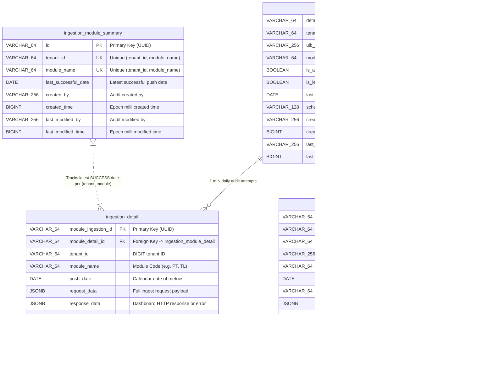

# Adapter Service (`adapter-service`)

A standalone Spring Boot microservice responsible for automated daily metrics extraction from UPYOG business databases, dynamic YAML schema mapping, payload transformation, validation, HTTP ingestion pushing to the National Dashboard, and Kafka audit logging.

---

## Key Features

1. **State-Configurable Multi-Module Framework**:
   * States choose which business modules (`PT`, `TL`, `WS`, etc.) to run via `schema-mapping.yml`.
   * Built on SOLID design principles using **Strategy Pattern** (`ModuleExtractor`) and **Registry Pattern** (`ExtractorRegistry`).
   * Zero-code changes required to add support for new business modules.

2. **Dynamic Database Query Mapping (`schema-mapping.yml`)**:
   * SQL queries are externalized in YAML. States customize table joins, column names, or legacy schemas without recompiling Java code.
   * Tolerates schema variations across state deployments via SQL column aliasing (`AS metricKey`).

3. **High-Performance Query Aggregation (2 DB Calls Total)**:
   * **DB Call 1**: Retrieves 8 scalar metrics and 3 array bucket metrics formatted directly as JSON via PostgreSQL `json_agg` / `json_build_object` subqueries.
   * **DB Call 2**: Retrieves daily payment collections and tax head account breakdowns (`PT_TAX`, `PT_FIRE_CESS`, `PT_TIME_REBATE`, `PT_TIME_PENALTY`, `PT_TIME_INTEREST`).

4. **Automated Catch-Up & Cron Scheduling**:
   * Tracks the latest successful ingestion date per tenant/module in `ingestion_module_summary`.
   * Automatically executes catch-up ingestion for missing date ranges (`last_successful_date + 1` up to yesterday inclusive) via daily CRON scheduling (`daily.ingestion.cron=0 0 1 * * ?`).

5. **Bulk Historical (Legacy) Backfilling & Smart Deduplication**:
   * Exposes REST endpoints (`/api/v1/legacy/ingest`) and background scheduler (`LegacyIngestionScheduler`) for historical data backfilling (e.g. last 5 months or custom date ranges).
   * **Smart Deduplication**: Queries `ingestion_detail` to automatically **skip already successfully ingested dates**, preventing duplicate pushes while safely resuming incomplete backfills.

6. **Kafka Audit Logging**:
   * Publishes detailed ingestion payloads and execution statuses to Kafka topics (`save-adapter-ingestion-detail`) for complete auditability.

7. **Transient Failure Resilience & Jittered Backoff Retries**:
   * Automatically retries transient errors on database queries (PGR & PT extractors), OAuth authentication/user search, and HTTP data ingestion pushes.
   * Employs exponential backoff with full jitter to avoid thundering herd problems on external systems and database connections.
   * Captures detailed retry attempt history (`RetryAttempt`) containing attempt numbers, status, failure reasons, and timestamps inside the `IngestionResult` model.

---

## Database Schema & ER Diagram



## Available API Endpoints Reference

Summary table of all REST API endpoints exposed by `adapter-service`:

| Method | Endpoint | Description |
| :--- | :--- | :--- |
| `GET` | `/adapter-services/api/v1/test` | Triggers daily data extraction and catch-up ingestion for enabled modules. |
| `POST` | `/adapter-services/api/v1/legacy/ingest` | Triggers bulk historical ingestion for a custom date range with smart deduplication. |
| `POST` | `/adapter-services/api/v1/legacy/ingest/last-months` | Triggers bulk historical ingestion for the last N months with smart deduplication. |

---

### Detailed Endpoint Documentation

#### 1. Daily Ingestion Trigger (`GET /adapter-services/api/v1/test`)
Triggers metric extraction and ingestion for all enabled modules across missing dates.

* **Method**: `GET`
* **Path**: `/adapter-services/api/v1/test`
* **Query Parameters**: None
* **cURL Example**:
  ```bash
  curl -X GET 'http://localhost:9999/adapter-services/api/v1/test'
  ```
* **Sample Response (`200 OK`)**:
  ```json
  [
    {
      "ingestionStatus": "SUCCESS",
      "responseData": "{\"ResponseInfo\":{\"apiId\":\"Rainmaker\",\"ver\":null,\"ts\":null,\"resMsgId\":\"uief87324\",\"msgId\":\"1784523332613|en_IN\",\"status\":null},\"responseHash\":[1231527387]}",
      "failureReason": null,
      "ingestedAt": 1784532600000,
      "date": "2026-07-22",
      "retryHistory": [
        {
          "attemptNumber": 1,
          "status": "FAILURE",
          "failureReason": "Connection timeout",
          "timestamp": 1784532598000
        },
        {
          "attemptNumber": 2,
          "status": "SUCCESS",
          "failureReason": null,
          "timestamp": 1784532600000
        }
      ]
    }
  ]
  ```

  If a module is already up-to-date up to yesterday, the service returns a status of `SKIPPED` instead of pushing duplicate data.
  
  **Sample skipped response:**
  ```json
  [
    {
      "ingestionStatus": "SKIPPED",
      "responseData": null,
      "failureReason": "Module PT is already up-to-date up to yesterday (2026-07-21)",
      "ingestedAt": 1784532600000,
      "date": "2026-07-21",
      "retryHistory": null
    }
  ]
  ```

---

#### 2. Custom Date Range Historical Ingestion (`POST /adapter-services/api/v1/legacy/ingest`)
Executes bulk ingestion for a specified date range (`startDate` to `endDate`). Automatically skips any dates within the range that were already successfully ingested.

* **Method**: `POST`
* **Path**: `/adapter-services/api/v1/legacy/ingest`
* **Query Parameters**:
  * `startDate` *(optional, string, ISO Date `YYYY-MM-DD`)*: Start date of historical range. Defaults to 5 months ago if omitted.
  * `endDate` *(optional, string, ISO Date `YYYY-MM-DD`)*: End date of historical range. Defaults to yesterday if omitted.
  * `module` *(optional, string)*: Module code filter (e.g. `PT`, `TL`). If omitted, processes all enabled modules.
* **cURL Example**:
  ```bash
  curl -X POST 'http://localhost:9999/adapter-services/api/v1/legacy/ingest?startDate=2026-01-01&endDate=2026-06-30&module=PT'
  ```
* **Sample Response (`200 OK`)**:
  ```json
  {
    "totalDatesRequested": 181,
    "datesSkipped": 175,
    "datesProcessedSuccessfully": 6,
    "datesFailed": 0,
    "skippedDates": [
      "PT:2026-01-01",
      "PT:2026-01-02",
      "..."
    ],
    "processedResults": [
      {
        "ingestionStatus": "SUCCESS",
        "responseData": "{\"ResponseInfo\":{...}}",
        "failureReason": null,
        "ingestedAt": 1784532600000
      }
    ]
  }
  ```

---

#### 3. Last N-Months Historical Ingestion (`POST /adapter-services/api/v1/legacy/ingest/last-months`)
Computes date range for the past N months up to yesterday and triggers bulk historical ingestion with smart deduplication.

* **Method**: `POST`
* **Path**: `/adapter-services/api/v1/legacy/ingest/last-months`
* **Query Parameters**:
  * `months` *(optional, integer, default: `5`)*: Number of months to look back.
  * `module` *(optional, string)*: Module code filter (e.g. `PT`, `TL`).
* **cURL Example**:
  ```bash
  curl -X POST 'http://localhost:9999/adapter-services/api/v1/legacy/ingest/last-months?months=5&module=PT'
  ```
* **Sample Response (`200 OK`)**:
  ```json
  {
    "totalDatesRequested": 150,
    "datesSkipped": 150,
    "datesProcessedSuccessfully": 0,
    "datesFailed": 0,
    "skippedDates": [
      "PT:2026-02-01",
      "..."
    ],
    "processedResults": []
  }
  ```

---

## State Onboarding & Deployment Guide: What States Need to Change & How

When deploying or onboarding `adapter-service` for a new state, follow this step-by-step configuration guide.

### Step 1: Database Connection Settings (`application.properties`)
Update the PostgreSQL connection parameters to point to your state's database instance:
```properties
spring.datasource.url=jdbc:postgresql://<STATE_DB_HOST>:5432/<STATE_DB_NAME>
spring.datasource.username=<DB_USERNAME>
spring.datasource.password=<DB_PASSWORD>
```

### Step 2: Location Context & State Tenant Config (`application.properties`)
Configure the location identifiers (ULB name/code, ward, region, and state tenant code) matching your state setup:
```properties
# State Tenant Code (e.g. 'pb' for Punjab, 'pg' for Punjab-Government/Testing, 'mh' for Maharashtra)
state.level.tenant.id=pg
adapter.system.user.tenantId=pg

# Location Context emitted in National Dashboard metrics
adapter.metric.ulb=pg.citya      # Your ULB Code (e.g., pb.amritsar or pg.citya)
adapter.metric.ward=Block 4     # Boundary / Ward Code or ULB Aggregate Name
adapter.metric.region=Test       # District / Region Name
adapter.metric.state=PG         # State Short Code (e.g., PB, PG, MH)
```

### Step 3: National Dashboard Endpoint & Credentials (`application.properties`)
Configure the destination ingestion endpoint URL and system user credentials provided by NIUA / National Dashboard team:
```properties
# National Dashboard Ingest API URL
national.dashboard.ingest.url=https://<NATIONAL_DASHBOARD_HOST>/national-dashboard/metric/_ingest

# System User Credentials for OAuth authentication
adapter.system.user.username=<SYSTEM_USER>
adapter.system.user.password=<SYSTEM_PASSWORD>
egov.user.oauth.basic.auth=Basic <BASE64_BASIC_AUTH_HEADER>
```

### Step 4: Enabled Business Modules (`schema-mapping.yml`)
Enable or disable business modules active in your state deployment under `extractor.enabled-modules`:
```yaml
extractor:
  enabled-modules:
    - PT    # Property Tax (Active)
    # - TL  # Trade License (Uncomment when onboarding TL)
    # - WS  # Water & Sewerage (Uncomment when onboarding WS)
```

### Step 5: SQL Query Customization (`schema-mapping.yml`)
If your state database uses customized table names, custom status codes, or extra filters, adjust the externalized SQL queries under `mappings.<MODULE>`:
* **Do NOT change column aliases** (`AS assessments`, `AS noOfPropertiesPaidToday`, etc.) as they are required by the National Dashboard metric specification.
* You can customize `WHERE` conditions, table join conditions, or tenant ID filters as needed for your state schema.

### Step 6: Initial Start Date & Daily Cron Schedule (`application.properties`)
Set the starting point for daily catch-up ingestion and the daily execution schedule:
```properties
# Fallback start date when launching for the first time (catch-up runs from this date to yesterday)
adapter.ingestion.default-start-date=2026-06-30

# Daily CRON schedule (default: 1:00 AM daily)
daily.ingestion.cron=0 0 1 * * ?
```

### Step 7: Historical Bulk Backfill Configuration (`application.properties`)
Configure parameters for bulk historical backfilling:
```properties
# Enable/disable automated background monthly historical backfill (default: false)
legacy.ingestion.enabled=false

# Legacy backfill schedule (default: 2:00 AM on the 1st of every month)
legacy.ingestion.cron=0 0 2 1 * ?

# Default lookback window in months when using N-month lookback trigger
legacy.ingestion.default-months=5
```

### Step 8: Resilience & Retry Configurations (`application.properties`)
The service comes pre-configured with reasonable defaults for retry behaviors. Customize them to tweak failure recovery limits:
```properties
# Database connection query retry parameters
adapter.db-retry.max-attempts=3
adapter.db-retry.base-delay-ms=1000
adapter.db-retry.max-delay-ms=5000

# OAuth endpoint token/search retry parameters
adapter.oauth-retry.max-attempts=3
adapter.oauth-retry.base-delay-ms=1000
adapter.oauth-retry.max-delay-ms=5000

# National Dashboard ingestion HTTP pushing retry parameters
adapter.retry.max-attempts=3
adapter.retry.base-delay-ms=1000
adapter.retry.max-delay-ms=5000
```

---

## Multi-Module Configuration (`schema-mapping.yml`)

```yaml
extractor:
  # Enable the business modules active for your state deployment
  enabled-modules:
    - PT
    # - TL
    # - WS

  # Externalized SQL queries per module
  mappings:
    PT:
      combinedMetricsQuery: |
        SELECT 
          (SELECT COUNT(*) FROM eg_pt_asmt_assessment WHERE createdtime >= :startTime AND createdtime <= :endTime AND tenantid = :tenantId) AS assessments,
          (SELECT COUNT(*) FROM eg_pt_property WHERE createdtime >= :startTime AND createdtime <= :endTime AND tenantid = :tenantId) AS todaysTotalApplications,
          ...
      collectionMetricsQuery: |
        SELECT ...
```

---

## Project Structure

```
adapter-service/
├── src/main/java/org/upyog/adapter/
│   ├── AdapterServiceApplication.java    # Main Spring Boot application entry point
│   ├── config/
│   │   └── SchemaMappingConfig.java      # Configuration properties for schema-mapping.yml
│   ├── controller/
│   │   ├── IngestionTestController.java  # REST controller for manual daily trigger (/api/v1/test)
│   │   └── LegacyIngestionController.java # REST controller for bulk historical triggers (/api/v1/legacy)
│   ├── entity/
│   │   ├── DailyIngestionData.java       # Entity for audit table ingestion_detail
│   │   └── IngestionModuleSummary.java   # Entity for tracker table ingestion_module_summary
│   ├── extractor/
│   │   └── ModuleExtractor.java          # Strategy interface for module data extraction
│   ├── model/
│   │   ├── DashboardData.java            # Normalized metric payload model
│   │   ├── IngestionResult.java          # Ingestion execution outcome model
│   │   └── LegacyIngestionResponse.java  # Bulk historical ingestion summary model
│   ├── pt/
│   │   └── extractor/
│   │       └── PtModuleExtractor.java    # Property Tax extraction implementation
│   ├── repository/
│   │   └── IngestionSummaryRepository.java # Repository for summary tracking & deduplication
│   ├── registry/
│   │   ├── ExtractorRegistry.java        # Registry auto-discovering ModuleExtractor beans
│   │   ├── TransformerRegistry.java      # Registry auto-discovering ModuleTransformer beans
│   │   └── ValidatorRegistry.java        # Registry auto-discovering ModuleValidator beans
│   ├── scheduler/
│   │   ├── DailyIngestionScheduler.java  # Daily CRON scheduler
│   │   └── LegacyIngestionScheduler.java # Monthly bulk historical scheduler
│   └── service/
│       ├── DailyIngestionService.java    # Multi-module daily ingestion & catch-up service
│       ├── LegacyIngestionService.java   # Bulk historical ingestion & deduplication service
│       └── OAuthTokenService.java        # OAuth2 token caching service
└── src/main/resources/
    ├── application.properties            # Datasource, Kafka, and cron properties
    └── schema-mapping.yml                # Dynamic SQL queries per module
```

---

## Building and Running

### Prerequisites
* Java 17+
* Maven 3.8+
* PostgreSQL Database (containing UPYOG core tables)

### Run Unit Tests
```bash
mvn clean test
```

### Run Locally
```bash
mvn spring-boot:run
```
Or build the executable JAR:
```bash
mvn clean package
java -jar target/adapter-service-2.0.0.jar
```
