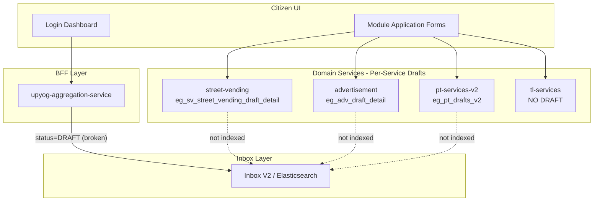
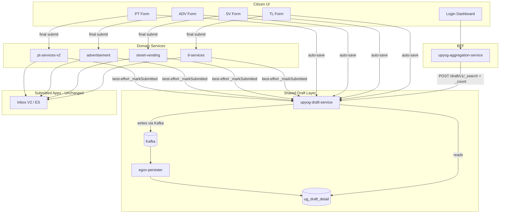
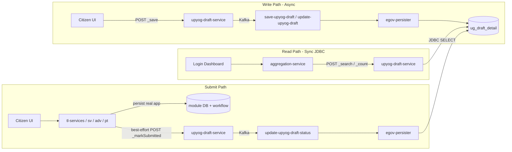
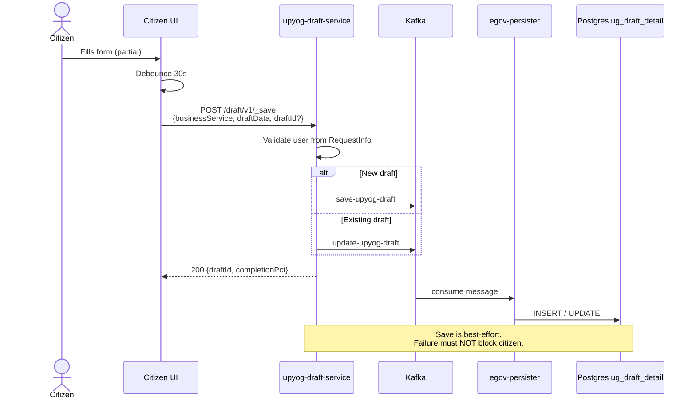
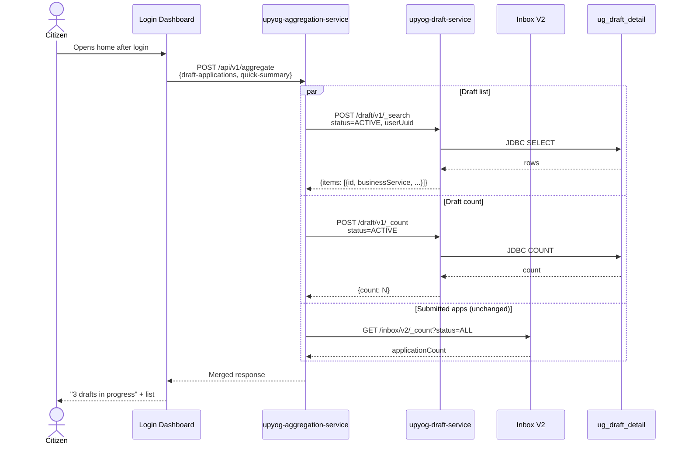
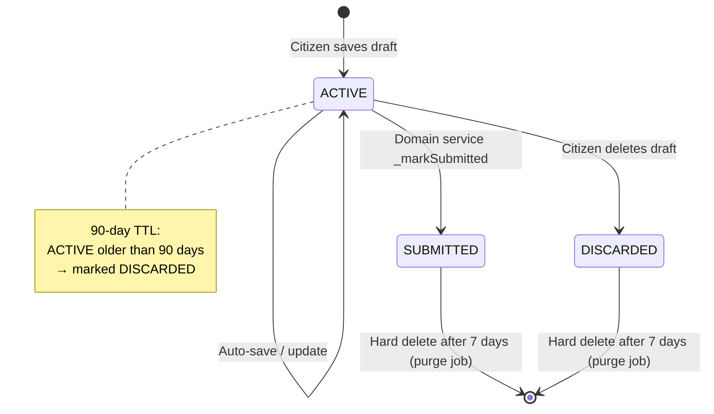
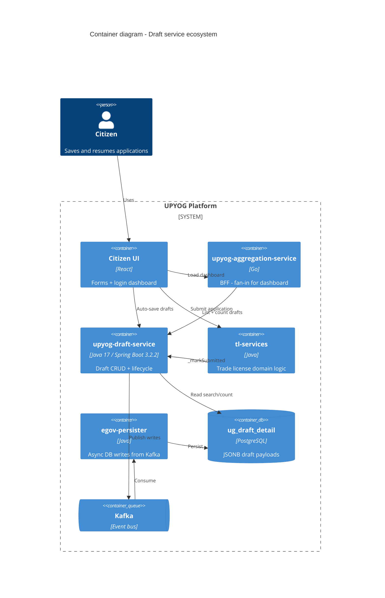
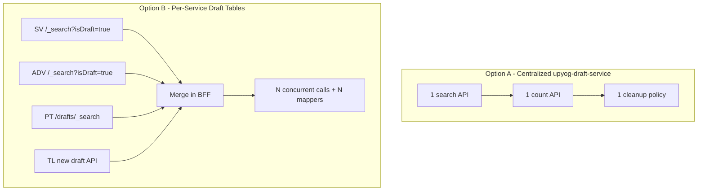
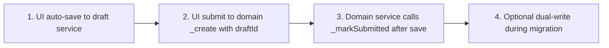
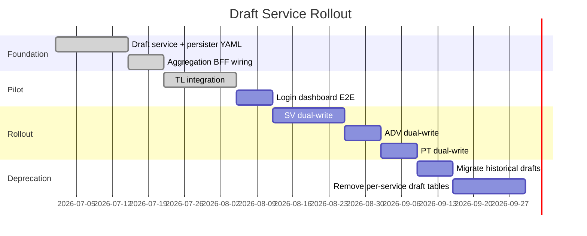

# UPYOG Centralized Draft Service — Architecture & Justification Document

**Service:** `upyog-draft-service`  
**Audience:** Platform, municipal module, frontend, and DevOps teams  
**Purpose:** Justify a separate centralized draft microservice vs. per-module draft tables  
**Status:** Pilot (TL integrated; SV/ADV/PT migration planned)

---

## 1. Executive Summary

Citizens need to **save in-progress municipal applications** (TL, Street Vending, Advertisement, Property Tax, etc.) and see a **count + list of incomplete applications on the login screen**.

Today, drafts are stored inconsistently across modules and are **not visible on the login dashboard**. The aggregation BFF was querying Inbox V2 with `status=DRAFT`, but per-service draft rows are **never indexed in Elasticsearch/Inbox V2** — so the dashboard always returned empty or zero.

**Recommendation:** Introduce **`upyog-draft-service`** — a standalone Java service with one Postgres table (`ug_draft_detail`) that:

- Stores opaque JSONB form payloads for any module (`businessService`: TL, SV, ADV, PT, …)
- Exposes a single `_search` + `_count` API for the login dashboard
- Lets domain services call `_markSubmitted` after a real application is created
- Uses the standard UPYOG persister pattern (Kafka → `egov-persister` → Postgres)

This aligns with existing DIGIT/UPYOG shared-service patterns (inbox, idgen, MDMS) and avoids N-way fan-out from the aggregation BFF as modules grow.

---

## 2. Problem Statement

| Pain point | Impact |
|------------|--------|
| TL has **no draft support** | Citizens lose partial TL form data on refresh/exit |
| SV, ADV, PT each have **different draft implementations** | Hard-delete vs soft-deactivate, different APIs, different tables |
| Login dashboard reads **Inbox V2 `status=DRAFT`** | Drafts are not in ES → count/list always wrong |
| Inbox V2 has **`/_search` only** — no `/_count` for drafts | Quick-summary draft count silently returns 0 |
| Draft deletion on submit is **conflated with draft save** in some modules | UX bugs when UI sends wrong flag |

**User story driving the design:**

> As a citizen, when I log in, I want to see how many applications I have in progress and resume any of them — across TL, SV, ADV, PT — from one place.

That is inherently a **cross-module, single-query** problem.

---

## 3. Current State (Before)



### Per-module draft landscape today

| Module | Draft table | Save pattern | Cleanup on submit | Dashboard visible? |
|--------|-------------|--------------|-------------------|-------------------|
| Street Vending | `eg_sv_street_vending_draft_detail` | `isDraftApplication=true` on `_create` | Hard delete via Kafka | No |
| Advertisement | `eg_adv_draft_detail` | Same inline flag | Hard delete + timer cleanup | No |
| Property Tax | `eg_pt_drafts_v2` | Dedicated `/drafts/_create` | Soft deactivate (`isActive=false`) | No |
| Trade License | None | N/A | N/A | No |

---

## 4. Proposed Architecture (After)



**Design principle:** Inbox V2 remains for **submitted / workflow-tracked** applications. Draft service handles **in-progress forms only**. Do not index JSONB draft blobs into Elasticsearch.

---

## 5. High-Level Data Flow



### Why async writes + sync reads?

This matches the established UPYOG pattern used by PT drafts, SV, TL, and others:

- **Writes:** Service → Kafka → `egov-persister` → Postgres (decoupled, retryable)
- **Reads:** Service → JDBC (low latency for dashboard list/count)

---

## 6. Sequence Diagrams

### 6.1 Auto-save draft (any module)



### 6.2 Final application submit (TL pilot)

```mermaid
sequenceDiagram
    actor Citizen
    participant UI as Citizen UI
    participant TL as tl-services
    participant WF as egov-workflow-v2
    participant Kafka as Kafka persister
    participant Draft as upyog-draft-service
    participant DB as ug_draft_detail

    Citizen->>UI: Click Submit
    UI->>TL: POST /v1/_create<br/>{Licenses, draftId}
    TL->>TL: Validate, enrich, calculate
    TL->>WF: Start workflow (if enabled)
    TL->>Kafka: save-tl-tradelicense
    TL->>Draft: POST /draft/v1/_markSubmitted<br/>{draftId} (best-effort)
    TL-->>UI: 200 Application created

    Draft->>Draft: Kafka: update-upyog-draft-status
    Note over Draft,DB: status = SUBMITTED

    alt Draft service unavailable
        TL->>TL: Submit still succeeds
        Note over Draft: Orphan ACTIVE draft remains;<br/>nightly reconciliation job fixes it
    end
```

### 6.3 Login dashboard — draft count + list



### 6.4 Draft lifecycle & cleanup



```mermaid
sequenceDiagram
    participant Scheduler as DraftCleanupScheduler
    participant Draft as upyog-draft-service
    participant Kafka
    participant Persister as egov-persister
    participant DB as ug_draft_detail

    Note over Scheduler: Nightly 2 AM (ShedLock)

    Scheduler->>Draft: purgeActiveOlderThan(90 days)
    Draft->>Kafka: update-upyog-draft-status (DISCARDED)
    Kafka->>Persister->>DB: UPDATE

    Scheduler->>Draft: purgeByStatusOlderThan(SUBMITTED, 7 days)
    Draft->>Kafka: delete-upyog-draft
    Kafka->>Persister->>DB: DELETE

    Scheduler->>Draft: reconcileOrphanedDrafts()
    Note over Draft: ACTIVE drafts with module_entity_id<br/>→ mark SUBMITTED
```

---

## 7. Component Responsibilities



| Component | Responsibility | Must NOT do |
|-----------|----------------|-------------|
| **upyog-draft-service** | Store/retrieve drafts; lifecycle (ACTIVE/SUBMITTED/DISCARDED); TTL purge | Run module validation, workflow, or fee calculation |
| **Domain services (TL, SV, …)** | Validate & persist real applications; call `_markSubmitted` | Own per-module draft tables long-term |
| **upyog-aggregation-service** | Single `_search` + `_count` for dashboard | Fan out to 10+ module draft endpoints |
| **Citizen UI** | Auto-save to draft service; pass `draftId` on submit | Route draft saves through domain `_create` |
| **egov-persister** | Apply SQL from `upyog-draft-persister.yml` | Business logic |

---

## 8. Data Model

### Table: `ug_draft_detail`

```sql
CREATE TABLE ug_draft_detail (
    draft_id           VARCHAR(64)  PRIMARY KEY,
    tenant_id          VARCHAR(64)  NOT NULL,
    business_service   VARCHAR(64)  NOT NULL,   -- TL, SV, ADV, PT
    module_name        VARCHAR(64),             -- TL, WS, BPA, etc.
    module_entity_id   VARCHAR(64),             -- optional link after partial create
    creator_type       VARCHAR(32)  NOT NULL DEFAULT 'USER', -- USER or EMPLOYEE
    draft_data         JSONB        NOT NULL,   -- opaque module form JSON
    completion_pct     NUMERIC(5,2) DEFAULT 0,
    status             VARCHAR(32)  NOT NULL DEFAULT 'ACTIVE',
    createdby          VARCHAR(64)  NOT NULL,
    lastmodifiedby     VARCHAR(64),
    createdtime        BIGINT       NOT NULL,
    lastmodifiedtime   BIGINT
);
```

**Key design choice:** `draft_data` is **opaque JSONB**. The draft service does not parse TL vs PT schemas. Each module owns the shape of its payload; the draft service only stores and returns it.

---

## 9. API Contract

**Base path:** `/upyog-draft-service/draft/v1`

| Endpoint | Method | Purpose |
|----------|--------|---------|
| `/_save` | POST | Create or update draft (upsert by `draftId`) |
| `/_search` | POST | List drafts for authenticated user |
| `/_count` | POST | Count active drafts (login widget) |
| `/_delete` | POST | Citizen discards draft |
| `/_markSubmitted` | POST | Domain service calls after successful `_create` |

**Auth:** All operations scoped to `RequestInfo.userInfo.uuid` from JWT. Cross-user access rejected.

**Dashboard response shape (aggregation mapping):**

```json
{
  "items": [{
    "id": "uuid",
    "businessService": "TL",
    "applicationNumber": "uuid",
    "lastModifiedTime": 1720000000000,
    "completionPercentage": 45.0
  }]
}
```

---

## 10. Persister Integration

**Config file:** `upyog-draft-persister.yml`

| Kafka topic | SQL operation |
|-------------|-----------------|
| `save-upyog-draft` | INSERT |
| `update-upyog-draft` | UPDATE draft_data |
| `update-upyog-draft-status` | UPDATE status |
| `delete-upyog-draft` | DELETE (purge) |

Register this YAML in **egov-persister** deployment alongside `pt-drafts.yml`, `advertisement-service-persister.yml`, etc.

---

## 11. Why NOT Per-Service Draft Tables? (Options Comparison)



| Dimension | Centralized `upyog-draft-service` | Per-service draft tables |
|-----------|-----------------------------------|--------------------------|
| Login dashboard query | **1 search + 1 count** | Fan-out to N services, merge/sort client-side |
| New module onboarding | Add `businessService` enum + client call | New table, migration, persister YAML, search API, BFF provider update |
| Consistency | One lifecycle, one cleanup policy | Drifts per team (SV hard-delete vs PT soft-deactivate) |
| Operational complexity | One more service to deploy | No new service, but N draft implementations |
| Failure isolation | Draft save is best-effort; submit never blocked | Same achievable, but duplicated in every module |
| State fork risk | Low — config-driven | High — each state may fork draft tables |
| Aligns with DIGIT principles | Yes — shared logic pooled | No — repeats per-module pattern |
| Migration effort | Medium — dual-write then cutover | Low for SV/ADV; still need TL + dashboard fix |

**Deciding factor:** The login-screen requirement is a **single-query cross-module problem**. That is the primary justification for a shared service.

---

## 12. Integration Pattern for Module Teams

### What each module team needs to do



| Step | Owner | Action |
|------|-------|--------|
| 1 | **Frontend** | Debounced `POST /draft/v1/_save` with `{businessService, draftData}` |
| 2 | **Frontend** | On submit, call domain `/_create` with `draftId` in request body |
| 3 | **Backend (domain)** | After successful persist, best-effort `POST /draft/v1/_markSubmitted` (2s timeout, fire-and-forget) |
| 4 | **Backend (migration)** | Dual-write to old table + draft service behind feature flag until cutover |

### TL pilot (implemented)

- UI saves drafts directly to `upyog-draft-service`
- `TradeLicenseRequest.draftId` optional on submit
- `DraftServiceClient.markSubmitted()` called after `repository.save()` in `TradeLicenseService.create()`

### Critical rule for all modules

> **Draft operations are best-effort.** A draft-service outage must **never** block or roll back a real application submission.

---

## 13. Migration Roadmap



| Phase | Scope |
|-------|-------|
| **Phase 1** | Deploy draft service; point aggregation providers to it; TL pilot |
| **Phase 2** | SV/ADV/PT dual-write (old table + draft service, feature flag per tenant) |
| **Phase 3** | Dashboard reads from draft service only; stop writing to old tables |
| **Phase 4** | One-time historical migration script; drop deprecated tables after 2 release cycles |

---

## 14. Non-Functional Requirements

| Requirement | Implementation |
|-------------|----------------|
| **Auth** | Draft search/count scoped to JWT `user_uuid`; no cross-user access |
| **PII** | JSONB at rest; modules may pre-encrypt sensitive fields before storing (match module approach) |
| **TTL** | ACTIVE drafts > 90 days → DISCARDED; SUBMITTED/DISCARDED purged after 7 days |
| **Rate limiting** | UI debounce ~30s; server-side max 1 save/5s per `draftId` (recommended) |
| **Observability** | Metrics: save latency, submit-cleanup success rate, orphaned draft count |
| **Distributed scheduler** | ShedLock on `draftCleanupJob` — only one pod runs nightly purge |

---

## 15. Risks & Mitigations

| Risk | Mitigation |
|------|------------|
| Draft service down during submit | Submit succeeds; orphan draft reconciled by nightly job |
| Draft deleted when user meant "Save Draft" | UI must call draft service `_save`, not domain `_create` with wrong flag |
| Eventual consistency (Kafka lag) | Dashboard may briefly show stale count; acceptable for drafts; reads are JDBC so lag is write-side only |
| Module teams resist migration | Phased dual-write; no big-bang cutover |
| JSONB payload size | Set max request body; UI should not attach file blobs (use fileStoreId references) |
| State-level forks | One national service + config vs 15+ bespoke draft tables per state |

---

## 16. FAQ for Other Teams

**Q: Why not put drafts in Inbox V2 / Elasticsearch?**  
A: Drafts are high-churn, schema-less JSON blobs with no workflow state. Indexing them in ES adds cost and complexity with no benefit for a simple list/count on login. Inbox V2 stays for submitted applications.

**Q: Why not add draft APIs to `upyog-aggregation-service`?**  
A: Aggregation is a read-optimized Go BFF (Redis cache, circuit breakers). Citizen draft data is a write path requiring Postgres, persister, and lifecycle jobs — not a BFF concern.

**Q: Why not use PT's `/drafts` pattern in every module?**  
A: PT's approach works for PT alone. The login dashboard needs **one query across all modules**. N per-module endpoints means N network calls, N failure modes, and N response mappers in the BFF.

**Q: Does TL need its own draft table?**  
A: **No.** TL form JSON lives in `ug_draft_detail.draft_data`. TL only calls `_markSubmitted` after real create.

**Q: What happens to existing SV/ADV/PT draft tables?**  
A: Dual-write during migration, then deprecate after historical data is migrated and two release cycles pass.

**Q: Is draft save synchronous for the citizen?**  
A: The API returns immediately after Kafka publish. Persister writes async (standard UPYOG pattern). Reads for resume may need a short delay if user saves and immediately navigates away — mitigated by UI debounce and optimistic `draftId` in client state.

---

## 17. Decision Summary

| Question | Answer |
|----------|--------|
| One service or per-service APIs? | **One centralized `upyog-draft-service`** |
| Where does login dashboard read from? | Draft service `_search` + `_count` via aggregation BFF |
| What happens to draft on submit? | Domain service calls `_markSubmitted`; draft service marks SUBMITTED then purges |
| What about existing SV schema? | Migrate via dual-write; deprecate `eg_sv_street_vending_draft_detail` |
| Does TL need its own draft table? | **No** |
| Where do writes go? | Kafka → `egov-persister` → `ug_draft_detail` |
| Where do reads go? | Direct JDBC in draft service (sync, low latency) |

---

## 18. References (Codebase)

| Artifact | Path |
|----------|------|
| Draft service | `municipal-services/upyog-draft-service/` |
| Persister YAML | `municipal-services/upyog-draft-service/src/main/resources/upyog-draft-persister.yml` |
| Aggregation draft list | `upyog-aggregation-service/internal/providers/draft_applications.go` |
| Aggregation draft count | `upyog-aggregation-service/internal/providers/quick_summary.go` |
| TL markSubmitted client | `tl-services/src/main/java/org/egov/tl/repository/DraftServiceClient.java` |
| PT drafts (prior art) | `pt-services-v2/src/main/resources/pt-drafts.yml` |
| SV drafts (prior art) | `street-vending` — `isDraftApplication` on `_create` |

---

## 19. Discussion Agenda (Suggested Meeting)

1. **Problem recap** — login dashboard draft count/list (5 min)
2. **Architecture walkthrough** — diagrams §4–§6 (15 min)
3. **Options comparison** — §11 (10 min)
4. **Module integration contract** — §12 (10 min)
5. **Migration plan & timeline** — §13 (10 min)
6. **Open questions** — per-team concerns (10 min)

**Expected outcome:** Agreement on centralized draft service as platform standard; module teams commit to dual-write migration windows.
