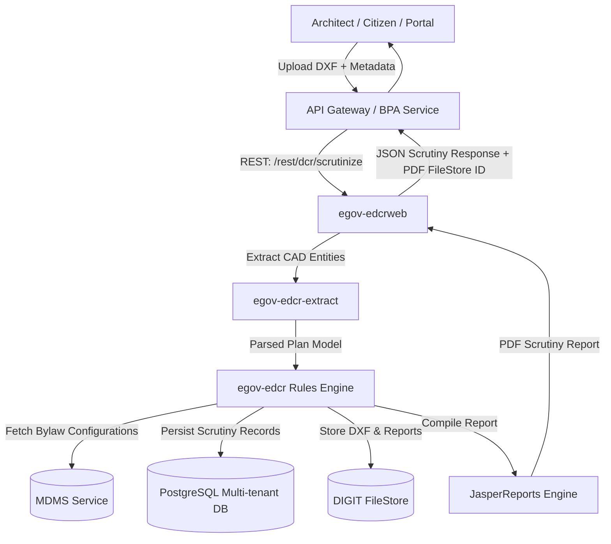

# eGov EDCR (Electronic Development Control Regulations) Service

[]()
[](https://www.oracle.com/java/technologies/javase/jdk17-archive-downloads.html)
[](https://spring.io/projects/spring-framework)
[](https://hibernate.org/orm/)
[](https://www.wildfly.org/)
[](https://www.gnu.org/licenses/gpl-3.0)
[](https://niua.in)

> **Automated Building Plan Scrutiny and DCR Bylaw Verification Engine** for Urban Local Bodies (ULBs) and State Development Authorities, built as part of the **UPYOG (Urban Platform for open and deliverable Online Governance)** initiative by **NIUA (National Institute of Urban Affairs)** and **eGovernments Foundation**.

---

## 📑 Table of Contents

- [Overview](#-overview)
- [Key Features](#-key-features)
- [Architecture & Module Breakdown](#-architecture--module-breakdown)
- [Technology Stack](#-technology-stack)
- [System Requirements & Prerequisites](#-system-requirements--prerequisites)
- [Configuration & Environment Variables](#-configuration--environment-variables)
- [Local Multitenancy & Domain Setup](#-local-multitenancy--domain-setup)
- [Build & Packaging](#-build--packaging)
- [Deployment Guide (WildFly & Docker)](#-deployment-guide)
- [IDE Setup Guide (IntelliJ & Eclipse)](#-ide-setup-guide)
- [REST API Reference](#-rest-api-reference)
- [Postman Collection & Testing](#-postman-collection--testing)
- [DXF Layer Standards & DCR Rule Features](#-dxf-layer-standards--dcr-rule-features)
- [Database & Migrations (Flyway)](#-database--migrations-flyway)
- [Contributing & Development Guidelines](#-contributing--development-guidelines)
- [License & Legal Attribution](#-license--legal-attribution)

---

## 🌟 Overview

**eGov EDCR** is a CAD-integrated rule validation engine that automates the verification of architectural building drawings against municipal Building By-laws (Development Control Regulations - DCR).

Architects and citizens submit building plans in AutoCAD DXF format through the Building Plan Approval (BPA) system. The EDCR engine:
1. Parses standard CAD DXF geometry, blocks, polylines, and annotation layers.
2. Extracts domain entities (plots, blocks, floors, rooms, setbacks, staircases, parking, utility spaces).
3. Evaluates extracted parameters against statutory bylaws (Kerala KMBR/KPBR, Bihar bylaws, Punjab bylaws, NBC guidelines, etc.) configured dynamically or through MDMS.
4. Generates an official Scrutiny Report in PDF format via JasperReports, documenting rule-by-rule compliance, measurements, violations, and final approval/rejection status.



---

## ✨ Key Features

- **Automated CAD Plan Extraction**: High-performance extraction of AutoCAD DXF primitives (polylines, arcs, layers, text entities, dimension blocks).
- **85+ Scrutiny Rule Features**: Out-of-the-box support for Floor Area Ratio (FAR), Ground Coverage, Building Height, Front/Rear/Side Setbacks, Access Roads, Exit Widths, Staircases (Fire, Spiral, General), Parking bays, Sanitation, Waste Water, Rainwater Harvesting, and Proximity to Monuments/Rivers.
- **Occupancy Certificate (OC) Scrutiny & Comparison**: Compares the completion plan against the approved permit drawing, automatically calculating allowable deviation thresholds.
- **Multi-Tenant Architecture**: Schema-based multi-tenancy supporting statewide deployments across hundreds of ULBs on a single service cluster.
- **Master Data Integration (MDMS)**: Seamless integration with DIGIT/UPYOG Master Data Management Service to dynamically load building rules, occupancy types, and parameter limits without redeployment.
- **JasperReports PDF Engine**: Generates pixel-perfect, tamper-evident building scrutiny reports with comprehensive check tables and rule citations.
- **Jakarta EE & Spring 6.x / Hibernate 6.x Compliance**: Modernized Java 17 enterprise foundation with enhanced performance, secure multi-threading, and non-blocking I/O.

---

## 🏛 Architecture & Module Breakdown

The project is structured as a multi-module Maven enterprise application located in `egov/`:

```
edcr/service/egov/
├── egov-config/            # Configuration assets, Jasper properties, message bundles, SQL templates
├── egov-egi/               # Core infrastructure: Multi-tenant JPA, Redis/Infinispan caching, security, filestore
├── egov-commons/          # Shared domain entities, MDMS client utilities, common DTOs and exceptions
├── egov-edcr-extract/      # DXF CAD drawing parser and geometric feature extraction engine
├── egov-edcr/              # Core DCR business logic, rule validator features, Jasper report templates
├── egov-egiweb/            # Infrastructure Web module (context root: /egi)
├── egov-edcrweb/           # EDCR REST API controllers and endpoints (context root: /edcr)
├── egov-ear/               # Enterprise Archive packaging module (builds egov-ear.ear)
├── pom.xml                 # Parent Maven Project Object Model
└── settings.xml            # Repository mirror and distribution settings
```

### Module Descriptions

| Module | Type | Description |
| :--- | :--- | :--- |
| **`egov-config`** | JAR | Holds global properties, message bundles (`service-message-edcr`, `common-errors`), font resources for PDF generation, and XML query mappings. |
| **`egov-egi`** | JAR | **eGov Infrastructure**. Handles `MultiTenantSchemaConnectionProvider`, Flyway database migrations, Redis HTTP session management, Infinispan second-level caching, and microservice HTTP clients. |
| **`egov-commons`** | JAR | Common business utilities, `BpaMdmsUtil` for querying MDMS data, and master data models. |
| **`egov-edcr-extract`** | JAR | Ingests `.dxf` files, interprets coordinate layers (e.g., `LAYER_PLOT_BOUNDARY`, `LAYER_FLOOR_NAME`), calculates areas, dimensions, and converts CAD entities into structured `Plan` models. |
| **`egov-edcr`** | JAR | Business rules engine. Contains rule processors for building height, setbacks, FAR, light/ventilation, access roads, and compiles PDF scrutiny reports via Jasper. |
| **`egov-egiweb`** | WAR | Web application for infrastructure services, filters (`CacheControlFilter`), and base web descriptors (`/egi`). |
| **`egov-edcrweb`** | WAR | Exposes the `/rest/dcr/*` REST API endpoints for plan scrutiny, OC comparison, plan extraction, and report retrieval (`/edcr`). |
| **`egov-ear`** | EAR | Bundles `egov-egiweb.war` and `egov-edcrweb.war` into a single enterprise archive with shared libraries in `lib/`. |

---

## 💻 Technology Stack

| Layer | Component / Library | Version |
| :--- | :--- | :--- |
| **Language** | Java (OpenJDK / Amazon Corretto / Eclipse Temurin) | **17 (LTS)** |
| **Framework** | Spring Framework | **6.1.21** |
| **Persistence / ORM** | Hibernate ORM / Jakarta Persistence | **6.4.8.Final / 3.1.0** |
| **Validation** | Jakarta Bean Validation (Hibernate Validator) | **3.0.2 / 8.0.1.Final** |
| **Servlet API** | Jakarta Servlet | **6.0.0** |
| **Caching** | Infinispan (Hibernate 2nd Level Cache) / Redis | **14.0.35.Final / 6.x** |
| **Reporting** | JasperReports & Apache PDFBox | **Jasper 6.20.0 / PDFBox 2.0.28** |
| **Database** | PostgreSQL + PostGIS extension | **42.7.10 (Driver)** |
| **DB Migrations** | Flyway | **9.22.3** |
| **Application Server** | WildFly Application Server / JBoss EAP | **26+ (WildFly 26.x)** |
| **Build Tool** | Apache Maven | **3.8+** |

---

## ⚙ System Requirements & Prerequisites

Ensure your development and deployment environments meet the following prerequisites:

* **JDK 17**: Amazon Corretto 17 or Eclipse Temurin 17 (`JAVA_HOME` pointing to JDK 17).
* **Maven**: Apache Maven 3.8.x or higher.
* **PostgreSQL**: PostgreSQL 12+ (or 9.6+) with `postgis` extension.
* **Redis**: Redis 6+ standalone server.
* **Application Server**: WildFly 26.x customized server with JDBC drivers and datasource configured.
* **Postman**: Postman 8.7+ for API testing.

---

## 🔧 Configuration & Environment Variables

Primary configuration files are located under `edcr/service/egov/`:
- `egov-egi/src/main/resources/config/application-config.properties`
- `egov-config/src/main/resources/config/jasperreports.properties`
- Custom overrides: `egov-config/src/main/resources/config/egov-erp-<username>.properties`

### Key Configuration Properties

```properties
# -------------------------------------------------------------
# General Settings
# -------------------------------------------------------------
dev.mode=false
master.server=true
client.id=bihar                            # State implementation ID (e.g. bihar, punjab, kerala)

# -------------------------------------------------------------
# Multi-Tenancy & Datasource
# -------------------------------------------------------------
multitenancy.enabled=true
default.schema.name=generic
default.jdbc.jndi.datasource=java:/READWRITE_DS
default.jdbc.jndi.readonly.datasource=java:/READONLY_DS

# -------------------------------------------------------------
# Redis Configuration (Standalone Setup)
# -------------------------------------------------------------
redis.host.name=localhost
redis.host.port=6379
redis.enable.embedded=false

# -------------------------------------------------------------
# FileStore & Microservices Integration
# -------------------------------------------------------------
ms.url=https://dev.digit.org
filestoreservice.beanname=localDiskFileStoreService   # or egovMicroServiceStore
max.file.upload.size=20971520                          # 20 MB max CAD file size

# -------------------------------------------------------------
# MDMS (Master Data Management Service)
# -------------------------------------------------------------
mdms.enable=false
mdms.host=http://localhost:8094/
mdms.searchurl=egov-mdms-service/v1/_search
mdms.searchurlv2=mdms-v2/v1/_search

# -------------------------------------------------------------
# State & Scrutiny Defaults
# -------------------------------------------------------------
edcr.default.state=pg
edcr.default.isStateWise=true
egov.edcr.default.limit=10
egov.edcr.max.limit=800
```

---

## 🌐 Local Multitenancy & Domain Setup

1. **Database Schema Creation**:
   Create a database and user in PostgreSQL, then create schemas named `state` and `generic`:
   ```sql
   CREATE DATABASE edcr_db;
   \c edcr_db;
   CREATE SCHEMA state;
   CREATE SCHEMA generic;
   ALTER ROLE postgres SET search_path TO state, generic, public;
   ```

2. **WildFly Tenant Property Configuration**:
   In your WildFly server directory under `${WILDFLY_HOME}/modules/system/layers/base/org/egov/settings/main/config/egov-erp-override.properties`, configure each state and ULB tenant mapping:
   ```properties
   tenant.localhost.state=state
   tenant.localhost=generic
   tenant.pg.citya=citya
   ```

3. **Database City Mapping**:
   In the `eg_city` table in your database, ensure the `domainurl` matches the configured tenant domain URL:
   ```sql
   INSERT INTO state.eg_city (id, name, localname, active, domainurl, code, createdby, createddate, lastmodifiedby, lastmodifieddate, version)
   VALUES (nextval('seq_eg_city'), 'City A', 'City A', true, 'localhost', 'pg.citya', 1, now(), 1, now(), 0);
   ```

4. **Hosts File Configuration**:
   If accessing via domain names or multiple virtual hosts, map them in your OS hosts file (`/etc/hosts` on Linux/macOS or `C:\Windows\System32\drivers\etc\hosts` on Windows):
   ```
   127.0.0.1   localhost.state
   127.0.0.1   www.upyogbpa.org
   ```

---

## 🔨 Build & Packaging

Navigate to the `edcr/service/egov` directory:

```bash
cd edcr/service/egov
```

### 1. Standard Build (Skip Tests)
```bash
mvn clean install -s settings.xml -DskipTests
```

### 2. Build with Custom Database Connection (For Flyway Migration during build)
```bash
mvn clean package -s settings.xml -Ddb.user=postgres -Ddb.password=postgres -Ddb.driver=org.postgresql.Driver -Ddb.url=jdbc:postgresql://localhost:5432/edcr_db
```

### 3. Build Artifacts Produced
- `egov-ear/target/egov-ear-*.ear` (Primary deployment EAR)
- `egov-edcrweb/target/egov-edcrweb-*.war` (EDCR Web application)
- `egov-egiweb/target/egov-egiweb-*.war` (Infrastructure Web application)

---

## 🚀 Deployment Guide

### Option 1: Deploying to WildFly Application Server

1. **Configure Datasource & Max Post Size in `standalone.xml`**:
   Edit `<WILDFLY_HOME>/standalone/configuration/standalone-full.xml` (or `standalone.xml`):
   ```xml
   <datasource jndi-name="java:/READWRITE_DS" pool-name="PostgresDS" enabled="true">
       <connection-url>jdbc:postgresql://localhost:5432/edcr_db</connection-url>
       <driver>postgresql</driver>
       <security>
           <user-name>postgres</user-name>
           <password>postgres</password>
       </security>
   </datasource>
   ```
   Increase HTTP request max size for large CAD drawings (e.g., 100 MB):
   ```xml
   <server name="default-server">
       <http-listener name="default" socket-binding="http" max-post-size="104857600" enable-http2="true"/>
       <host name="default-host" alias="localhost">
           <location name="/" handler="welcome-content"/>
       </host>
   </server>
   ```

2. **Deploy EAR Package**:
   * Copy `egov-ear/target/egov-ear-*.ear` to `<WILDFLY_HOME>/standalone/deployments/`
   * Create an empty marker file named `egov-ear-*.ear.dodeploy` in the deployments folder.

3. **Start WildFly Server**:
   ```bash
   # Windows
   %WILDFLY_HOME%\bin\standalone.bat -c standalone-full.xml -b 0.0.0.0

   # Linux / macOS
   $WILDFLY_HOME/bin/standalone.sh -c standalone-full.xml -b 0.0.0.0
   ```

### Option 2: Docker Deployment

The included `Dockerfile` in `edcr/service/` builds with `amazoncorretto:17-alpine` and deploys to the runtime image `nudmcdg/edcr-wildfly26:07`:

```bash
docker build -t uypog-edcr-service:latest -f edcr/service/Dockerfile .
docker run -p 8080:8080 -e DB_URL=jdbc:postgresql://host.docker.internal:5432/edcr_db uypog-edcr-service:latest
```

---

## 💻 IDE Setup Guide

### IntelliJ IDEA
1. Open IntelliJ and open the `edcr/service/egov` directory.
2. In **Project Structure** (`Ctrl+Alt+Shift+S`):
   - Set **Project SDK** to **Java 17**.
   - Under **Maven -> User Settings File**, select `edcr/service/egov/settings.xml`.
3. Add a **JBoss / WildFly Server** Run Configuration pointing to your local WildFly 26 directory.
4. Add `egov-ear:ear exploded` to the deployment tab.

### Eclipse
1. Import existing Maven project pointing to `edcr/service/egov/`.
2. Configure `settings.xml`: Navigate to `Windows -> Preferences -> Maven -> User Settings` and point to `edcr/service/egov/settings.xml`.
3. Configure WildFly Server via JBoss Tools and add the EAR project.

---

## 📡 REST API Reference

All primary scrutiny endpoints are exposed under `/rest/dcr/*` (`http://<host>:<port>/edcr/rest/dcr/*`).

### 1. Scrutinize Building Plan (Standard)
* **Endpoint**: `POST /edcr/rest/dcr/scrutinize`
* **Content-Type**: `multipart/form-data`
* **Parameters**:
  - `planFile` *(File, Binary)*: The `.dxf` CAD drawing file.
  - `edcrRequest` *(String, JSON)*: Metadata including tenant ID, applicant info, building classification, and request info.
* **Header**: `x-user-info` *(JSON, Optional)*: User context injected by API gateway.
* **Response**: `200 OK` with JSON scrutiny report and PDF `fileStoreId`.

### 2. Fetch EDCR Details (Search by Application / EDCR Number)
* **Endpoint**: `POST /edcr/rest/dcr/edcrdetails?tenantId={tenantId}&applicationNumber={appNo}`
* **Content-Type**: `application/json`
* **Query Parameters**: `tenantId`, `applicationNumber`, `edcrNumber`, `status`, `pageNumber`, `pageSize`
* **Request Body**:
  ```json
  {
    "RequestInfo": {
      "apiId": "org.egov.edcr",
      "ver": "1.0",
      "ts": 1714567890000,
      "action": "_search",
      "did": "1",
      "msgId": "edcr-search-001",
      "authToken": "{{authToken}}",
      "userInfo": {
        "id": 1,
        "uuid": "USER_UUID",
        "tenantId": "pg.citya"
      }
    }
  }
  ```

### 3. Fetch Full Scrutiny History
* **Endpoint**: `POST /edcr/rest/dcr/scrutinydetails?tenantId={tenantId}&edcrNumber={edcrNumber}`
* **Content-Type**: `application/json`
* **Body**: `RequestInfo` wrapper.

### 4. CAD Plan Data Extraction
* **Endpoint**: `POST /edcr/rest/dcr/extractplan`
* **Content-Type**: `multipart/form-data` (`planFile` + `edcrRequest`)
* **Description**: Extracts raw geometrical features as structured `Plan` JSON without executing scrutiny rules.

### 5. Scrutinize Occupancy Certificate Plan
* **Endpoint**: `POST /edcr/rest/dcr/scrutinizeocplan`
* **Content-Type**: `multipart/form-data` (`planFile` + `edcrRequest`)

### 6. Occupancy Comparison Report
* **Endpoint**: `POST /edcr/rest/dcr/occomparison`
* **Content-Type**: `application/json` (`ComparisonRequest`)

### 7. Download Scrutiny Report PDF / CAD File
* **Endpoint**: `GET /edcr/rest/dcr/downloadfile?fileStoreId={fileStoreId}`
* **Response**: Binary PDF or DXF stream.

---

## 📬 Postman Collection & Testing

A complete, pre-configured Postman collection is included in the codebase:

* **File Location**: [`edcr/service/egov/egov-edcr/Postman/eDcr Collection.postman_collectionv.1.json`](file:///d:/NIUA/Edcr(Niua-dev-2.0)/UPYOG-NIUA-Abhishek/edcr/service/egov/egov-edcr/Postman/eDcr%20Collection.postman_collectionv.1.json)

**How to Use**:
1. Open **Postman** -> Click **Import**.
2. Select the JSON collection file above.
3. Set your environment variables (`host`, `port`, `tenantId`, `authToken`).

---

## 📐 DXF Layer Standards & DCR Rule Features

EDCR expects CAD drawings to adhere to standardized layer naming conventions:

| Scrutiny Feature Area | Standard DXF Layers / Elements | Extracted Parameters & Validation |
| :--- | :--- | :--- |
| **Plot & Boundary** | `PLOT_BOUNDARY`, `NORTH_DIRECTION` | Plot area, shape, road frontage, orientation. |
| **Built-up & FAR** | `FLOOR_PLAN_FLR_*`, `BUILT_UP_AREA` | Floor-wise built-up area, carpet area, FAR index calculation. |
| **Ground Coverage** | `COVERAGE_AREA`, `BUILDING_FOOTPRINT` | Percentage of ground covered vs max permissible. |
| **Setbacks & Yards** | `SETBACK_FRONT`, `SETBACK_REAR`, `SETBACK_SIDE` | Minimum front, rear, and side yard clearance measurements. |
| **Building Height** | `BUILDING_HEIGHT`, `HEAD_ROOM` | Total height, road width-to-height ratio, floor height. |
| **Staircases & Ramps** | `GENERAL_STAIR`, `FIRE_STAIR`, `RAMP` | Tread width, riser height, flight width, handrail height, exit capacity. |
| **Parking Facilities** | `CAR_PARKING`, `TWO_WHEELER`, `DA_PARKING` | Number of standard, two-wheeler, and disabled parking bays. |
| **Sanitation & Fixtures** | `TOILET_DETAILS`, `WATER_CLOSET`, `BATH_ROOM` | Minimum room dimensions, ventilation, fixture counts. |
| **Safety & Environment** | `RAIN_WATER_HARVESTING`, `SOLAR`, `SEPTIC_TANK` | Capacity, dimension, distance from well / plot boundary. |

---

## 🗄 Database & Migrations (Flyway)

Flyway manages schema versions automatically at service startup.

### File Locations:
* Main DDL & DML Scripts: `egov-edcr/src/main/resources/db/migration/main/`
* Sample Migration Scripts: `egov-edcr/src/main/resources/db/migration/sample/`

### Migration Script Naming Format:
```
V<YYYYMMDDHHMMSS>__<module_name>_<short_description>.sql
```
**Example**: `V20260821143000__edcr_rule_updates.sql`

---

## 🤝 Contributing & Development Guidelines

1. **Branching Strategy**: Follow GitFlow practices (`feature/<name>`, `bugfix/<issue-id>`).
2. **Java 17 & Jakarta EE Standards**: Maintain clean, modern Java 17 code using `jakarta.*` packages.
3. **Commit Messages**: Follow standard UPYOG prefixes (e.g. `[EDCR] <Module>: Short description`).
4. **Unit Tests**: Ensure rule validation tests in `egov-edcr/src/test/` pass before opening PRs.

---

## 📜 License & Legal Attribution

This program is free software: you can redistribute it and/or modify it under the terms of the **GNU General Public License (GPLv3)** as published by the Free Software Foundation.

### Attribution Notice
* All user interfaces and derived works must display the **eGovernments Foundation** logo on the top right corner as per attribution guidelines.
* Copyright (C) 2017–2026 **eGovernments Foundation** and **National Institute of Urban Affairs (NIUA)**.
