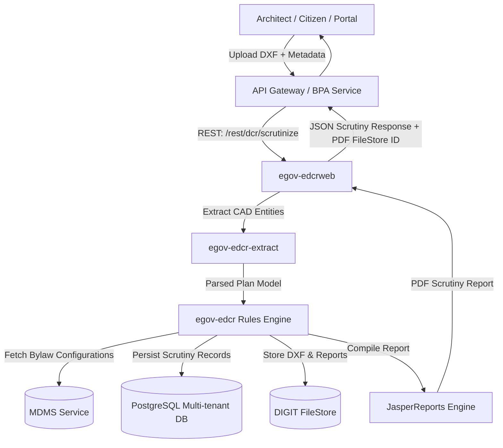

# eGov EDCR (Electronic Development Control Regulations) Service

[]()
[](https://www.oracle.com/java/technologies/javase/jdk17-archive-downloads.html)
[](https://spring.io/projects/spring-framework)
[](https://hibernate.org/orm/)
[](https://www.wildfly.org/)
[](https://www.gnu.org/licenses/gpl-3.0)
[](https://niua.in)

> **Automated Building Plan Scrutiny and DCR Bylaw Verification Engine** for Urban Local Bodies (ULBs) and State Development Authorities, built as part of the **UPYOG (Urban Platform for open and deliverable Online Governance)** initiative by **NIUA (National Institute of Urban Affairs)** and **eGovernments Foundation**.

---

## 📑 Table of Contents

- [Overview](#-overview)
- [Key Features](#-key-features)
- [Architecture & Module Breakdown](#-architecture--module-breakdown)
- [Technology Stack](#-technology-stack)
- [System Requirements](#-system-requirements)
- [Configuration & Environment Variables](#-configuration--environment-variables)
- [Build & Packaging](#-build--packaging)
- [Deployment Guide](#-deployment-guide)
- [REST API Reference](#-rest-api-reference)
- [DXF Layer Standards & Scrutiny Features](#-dxf-layer-standards--dcr-rule-features)
- [Database & Migrations](#-database--migrations)
- [Contributing & Development Guidelines](#-contributing--development-guidelines)
- [License & Legal Attribution](#-license--legal-attribution)

---

## 🌟 Overview

**eGov EDCR** is a CAD-integrated rule validation engine that automates the verification of architectural building drawings against municipal Building By-laws (Development Control Regulations - DCR).

Architects and citizens submit building plans in AutoCAD DXF format through the Building Plan Approval (BPA) system. The EDCR engine:
1. Parses standard CAD DXF geometry, blocks, polylines, and annotation layers.
2. Extracts domain entities (plots, blocks, floors, rooms, setbacks, staircases, parking, utility spaces).
3. Evaluates extracted parameters against statutory bylaws (Kerala KMBR/KPBR, Bihar bylaws, NBC guidelines, etc.) configured dynamically or through MDMS.
4. Generates an official Scrutiny Report in PDF format via JasperReports, documenting rule-by-rule compliance, measurements, violations, and final approval/rejection status.



---

## ✨ Key Features

- **Automated CAD Plan Extraction**: High-performance extraction of AutoCAD DXF primitives (polylines, arcs, layers, text entities, dimension blocks).
- **85+ Scrutiny Rule Features**: Out-of-the-box support for Floor Area Ratio (FAR), Ground Coverage, Building Height, Front/Rear/Side Setbacks, Access Roads, Exit Widths, Staircases (Fire, Spiral, General), Parking bays, Sanitation, Waste Water, Rainwater Harvesting, and Proximity to Monuments/Rivers.
- **Occupancy Certificate (OC) Scrutiny & Comparison**: Compares the completion plan against the approved permit drawing, automatically calculating allowable deviation thresholds.
- **Multi-Tenant Architecture**: Schema-based multi-tenancy supporting statewide deployments across hundreds of ULBs on a single service cluster.
- **Master Data Integration (MDMS)**: Seamless integration with DIGIT/UPYOG Master Data Management Service to dynamic load building rules, occupancy types, and parameter limits without redeployment.
- **JasperReports PDF Engine**: Generates pixel-perfect, tamper-evident building scrutiny reports with comprehensive check tables and rule citations.
- **Jakarta EE 10 & Spring 6.x Compliance**: Modernized Java 17 enterprise foundation with enhanced performance, secure multi-threading, and non-blocking I/O.

---

## 🏛 Architecture & Module Breakdown

The project is structured as a multi-module Maven enterprise application:

```
edcr/service/egov/
├── egov-config/            # Configuration assets, Jasper properties, message bundles, SQL templates
├── egov-egi/               # Core infrastructure: Multi-tenant JPA, Redis/Infinispan caching, security, filestore
├── egov-commons/          # Shared domain entities, MDMS client utilities, common DTOs and exceptions
├── egov-edcr-extract/      # DXF CAD drawing parser and geometric feature extraction engine
├── egov-edcr/              # Core DCR business logic, rule validator features, Jasper report templates
├── egov-egiweb/            # Infrastructure Web module (context root: /egi)
├── egov-edcrweb/           # EDCR REST API controllers and endpoints (context root: /edcr)
├── egov-ear/               # Enterprise Archive packaging module (builds egov-ear.ear)
├── pom.xml                 # Parent Maven Project Object Model
└── settings.xml            # Repository mirror and distribution settings
```

### Module Descriptions

| Module | Type | Description |
| :--- | :--- | :--- |
| **`egov-config`** | JAR | Holds global properties, message bundles (`service-message-edcr`, `common-errors`), font resources for PDF generation, and XML query mappings. |
| **`egov-egi`** | JAR | **eGov Infrastructure**. Handles `MultiTenantSchemaConnectionProvider`, Flyway database migrations, Redis HTTP session management, Infinispan second-level caching, and microservice HTTP clients. |
| **`egov-commons`** | JAR | Common business utilities, `BpaMdmsUtil` for querying MDMS data, and master data models. |
| **`egov-edcr-extract`** | JAR | Ingests `.dxf` files, interprets coordinate layers (e.g., `LAYER_PLOT_BOUNDARY`, `LAYER_FLOOR_NAME`), calculates areas, dimensions, and converts CAD entities into structured `Plan` models. |
| **`egov-edcr`** | JAR | Business rules engine. Contains rule processors for building height, setbacks, FAR, light/ventilation, access roads, and compiles PDF scrutiny reports via Jasper. |
| **`egov-egiweb`** | WAR | Web application for infrastructure services, filters (`CacheControlFilter`), and base web descriptors (`/egi`). |
| **`egov-edcrweb`** | WAR | Exposes the `/rest/dcr/*` REST API endpoints for plan scrutiny, OC comparison, plan extraction, and report retrieval (`/edcr`). |
| **`egov-ear`** | EAR | Bundles `egov-egiweb.war` and `egov-edcrweb.war` into a single enterprise archive (`egov-ear-2.1.1-SNAPSHOT.ear`) with shared libraries in `lib/`. |

---

## 💻 Technology Stack

| Layer | Component / Library | Version |
| :--- | :--- | :--- |
| **Language** | Java (OpenJDK / Eclipse Temurin) | **17 (LTS)** |
| **Framework** | Spring Framework | **6.1.21** |
| **Persistence / ORM** | Hibernate ORM / Jakarta Persistence | **6.4.8.Final / 3.1.0** |
| **Validation** | Jakarta Bean Validation (Hibernate Validator) | **3.0.2 / 8.0.1.Final** |
| **Servlet API** | Jakarta Servlet | **6.0.0** |
| **Caching** | Infinispan (Hibernate 2nd Level Cache) / Redis | **14.0.35.Final / 6.x** |
| **Reporting** | JasperReports & Apache PDFBox | **Jasper 6.x / PDFBox 2.0.28** |
| **Database** | PostgreSQL + PostGIS extension | **42.7.10 (Driver)** |
| **DB Migrations** | Flyway | Supported |
| **Application Server** | WildFly Application Server / JBoss EAP | **26+ / Jakarta EE compatible** |
| **Build Tool** | Apache Maven | **3.8+** |

---

## ⚙ System Requirements

Before building and running the EDCR service, ensure your development and production environments meet the following prerequisites:

- **JDK**: Java 17 64-bit (`JAVA_HOME` pointing to JDK 17).
- **Maven**: Apache Maven 3.8.0 or higher.
- **Database**: PostgreSQL 12+ with `postgis` extension enabled for spatial geometries.
- **Redis**: Redis 6+ (for distributed session storage and caching).
- **Application Server**: WildFly 26+ installed and configured with appropriate JDBC JNDI datasources (`java:/READWRITE_DS`).
- **Network / Dependencies**: Access to NIUA / DIGIT Nexus repository mirrors configured in [settings.xml](file:///d:/NIUA/Edcr(Niua-dev-2.0)/UPYOG-NIUA-Abhishek/edcr/service/egov/settings.xml).

---

## 🔧 Configuration & Environment Variables

Primary configuration files are located under:
- `egov-egi/src/main/resources/config/application-config.properties`
- `egov-config/src/main/resources/custom.properties`

### Key Configuration Parameters

```properties
# -------------------------------------------------------------
# General Settings
# -------------------------------------------------------------
dev.mode=false
master.server=true
client.id=bihar                            # State implementation ID (e.g. bihar, punjab, kerala)

# -------------------------------------------------------------
# Multi-Tenancy & Datasource
# -------------------------------------------------------------
multitenancy.enabled=true
default.schema.name=generic
default.jdbc.jndi.datasource=java:/READWRITE_DS
default.jdbc.jndi.readonly.datasource=java:/READONLY_DS

# -------------------------------------------------------------
# Redis Configuration
# -------------------------------------------------------------
redis.host.name=localhost
redis.host.port=6379
redis.enable.embedded=false

# -------------------------------------------------------------
# FileStore & Microservices Integration
# -------------------------------------------------------------
ms.url=https://dev.digit.org
filestoreservice.beanname=localDiskFileStoreService   # or egovMicroServiceStore
max.file.upload.size=20971520                          # 20 MB max CAD file size

# -------------------------------------------------------------
# MDMS (Master Data Management Service)
# -------------------------------------------------------------
mdms.enable=false
mdms.host=http://localhost:8094/
mdms.searchurl=egov-mdms-service/v1/_search
mdms.searchurlv2=mdms-v2/v1/_search

# -------------------------------------------------------------
# State & Scrutiny Defaults
# -------------------------------------------------------------
edcr.default.state=pg
edcr.default.isStateWise=true
egov.edcr.default.limit=10
egov.edcr.max.limit=800
```

---

## 🔨 Build & Packaging

Build the complete enterprise project using Maven with the custom repository settings:

### 1. Standard Build (Skip Tests for Fast Packaging)

```bash
mvn clean install -s settings.xml -DskipTests
```

### 2. Full Build with Automated Tests

```bash
mvn clean install -s settings.xml
```

### 3. Build Artifacts Produced

Upon a successful build, the target artifacts will be generated in:
- `egov-ear/target/egov-ear-2.1.1-SNAPSHOT.ear` (Primary deployment archive)
- `egov-edcrweb/target/egov-edcrweb-2.1.1-SNAPSHOT.war`
- `egov-egiweb/target/egov-egiweb-2.1.1-SNAPSHOT.war`

---

## 🚀 Deployment Guide

### Deploying to WildFly Application Server

1. **Configure WildFly Datasource**:
   In WildFly's `standalone.xml` or `standalone-full.xml`, configure the PostgreSQL datasource with JNDI name `java:/READWRITE_DS`:
   ```xml
   <datasource jndi-name="java:/READWRITE_DS" pool-name="PostgresDS" enabled="true">
       <connection-url>jdbc:postgresql://localhost:5432/edcr_db</connection-url>
       <driver>postgresql</driver>
       <security>
           <user-name>postgres</user-name>
           <password>postgres</password>
       </security>
       <validation>
           <valid-connection-checker class-name="org.jboss.jca.adapters.jdbc.extensions.postgres.PostgreSQLValidConnectionChecker"/>
           <validate-on-match>true</validate-on-match>
           <background-validation>false</background-validation>
       </validation>
   </datasource>
   ```

2. **Deploy EAR Package**:
   Copy the built EAR artifact into the WildFly deployments folder:
   ```bash
   cp egov-ear/target/egov-ear-2.1.1-SNAPSHOT.ear $WILDFLY_HOME/standalone/deployments/
   ```

3. **Start WildFly**:
   ```bash
   # Linux / macOS
   $WILDFLY_HOME/bin/standalone.sh -c standalone-full.xml

   # Windows
   %WILDFLY_HOME%\bin\standalone.bat -c standalone-full.xml
   ```

4. **Verify Application Deployment**:
   - EDCR Context Root: `http://localhost:8080/edcr`
   - EGI Context Root: `http://localhost:8080/egi`

---

## 📡 REST API Reference

All primary scrutiny endpoints are exposed under `/rest/dcr/*` (Full URL: `http://<host>:<port>/edcr/rest/dcr/*`).

### 1. Scrutinize Building Plan (Standard)
- **Endpoint**: `POST /rest/dcr/scrutinize`
- **Content-Type**: `multipart/form-data`
- **Request Parameters**:
  - `planFile` *(File, Binary)*: The `.dxf` CAD drawing file.
  - `edcrRequest` *(String, JSON)*: Metadata including tenant ID, applicant info, building classification, and request info.
- **Header**: `x-user-info` *(JSON, Optional)*: User context injected by API gateway.
- **Response**: `200 OK` with JSON scrutiny report and PDF `fileStoreId`.

### 2. Scrutinize Occupancy Certificate Plan
- **Endpoint**: `POST /rest/dcr/scrutinizeocplan`
- **Content-Type**: `multipart/form-data`
- **Parameters**: `planFile` (DXF), `edcrRequest` (JSON)
- **Description**: Validates as-built drawings against OC standards.

### 3. Anonymous Plan Scrutiny (Pre-Check)
- **Endpoint**: `POST /rest/dcr/anonymousScrutinize`
- **Content-Type**: `multipart/form-data`
- **Parameters**: `planFile` (DXF), `edcrRequest` (JSON)
- **Description**: Allows public pre-evaluation of drawings before formal submission.

### 4. CAD Plan Data Extraction
- **Endpoint**: `POST /rest/dcr/extractplan`
- **Content-Type**: `multipart/form-data`
- **Parameters**: `planFile` (DXF), `edcrRequest` (JSON)
- **Description**: Extracts raw geometrical features (plots, rooms, blocks) as a structured `Plan` JSON object without rule execution.

### 5. Fetch Scrutiny History
- **Endpoint**: `POST /rest/dcr/scrutinydetails`
- **Content-Type**: `application/json`
- **Request Body**: `RequestInfoWrapper` with search parameters (`transactionNumber`, `applicationNumber`, `tenantId`).

### 6. Occupancy Comparison Report
- **Endpoint**: `POST /rest/dcr/occomparison`
- **Content-Type**: `application/json`
- **Description**: Compares sanctioned permit plan features with occupancy certificate plan features to verify tolerance limits.

### 7. Download Scrutiny Report / CAD Document
- **Endpoint**: `GET /rest/dcr/downloadfile?fileStoreId={fileStoreId}`
- **Response**: PDF/DXF binary stream with appropriate `Content-Disposition`.

---

## 📐 DXF Layer Standards & DCR Rule Features

EDCR expects CAD drawings to adhere to standardized layer naming conventions. Key features and layer mappings include:

| Scrutiny Feature Area | Standard DXF Layers / Elements | Extracted Parameters & Validation |
| :--- | :--- | :--- |
| **Plot & Boundary** | `PLOT_BOUNDARY`, `NORTH_DIRECTION` | Plot area, shape, road frontage, orientation. |
| **Built-up & FAR** | `FLOOR_PLAN_FLR_*`, `BUILT_UP_AREA` | Floor-wise built-up area, carpet area, FAR index calculation. |
| **Ground Coverage** | `COVERAGE_AREA`, `BUILDING_FOOTPRINT` | Percentage of ground covered vs max permissible. |
| **Setbacks & Yards** | `SETBACK_FRONT`, `SETBACK_REAR`, `SETBACK_SIDE` | Minimum front, rear, and side yard clearance measurements. |
| **Building Height** | `BUILDING_HEIGHT`, `HEAD_ROOM` | Total height, road width-to-height ratio, floor height. |
| **Staircases & Ramps** | `GENERAL_STAIR`, `FIRE_STAIR`, `RAMP` | Tread width, riser height, flight width, handrail height, exit capacity. |
| **Parking Facilities** | `CAR_PARKING`, `TWO_WHEELER`, `DA_PARKING` | Number of standard, two-wheeler, and disabled parking bays. |
| **Sanitation & Fixtures** | `TOILET_DETAILS`, `WATER_CLOSET`, `BATH_ROOM` | Minimum room dimensions, ventilation, fixture counts. |
| **Safety & Environment** | `RAIN_WATER_HARVESTING`, `SOLAR`, `SEPTIC_TANK` | Capacity, dimension, distance from well / plot boundary. |

---

## 🗄 Database & Migrations

Database migration scripts are automatically managed by Flyway during service startup:
- Main DDL & DML Scripts: `egov-edcr/src/main/resources/db/migration/main/`
- Sample Migration Scripts: `egov-edcr/src/main/resources/db/migration/sample/`

To manually execute migrations or verify database status:
```properties
db.migration.enabled=true
db.flyway.validateon.migrate=false
```

---

## 🤝 Contributing & Development Guidelines

1. **Branching Strategy**: Follow standard GitFlow practices (`feature/<name>`, `bugfix/<issue-id>`).
2. **Java 17 Code Style**: Keep code compliant with modern Java features, avoiding deprecated APIs.
3. **Dead Code Policy**: Security and local session authentication beans have been superseded by the upstream API Gateway. Do not re-introduce monolithic local token stores.
4. **Unit & Integration Testing**: Ensure rule tests in `egov-edcr/src/test/` pass before opening pull requests.

---

## 📜 License & Legal Attribution

This program is free software: you can redistribute it and/or modify it under the terms of the **GNU General Public License (GPLv3)** as published by the Free Software Foundation.

### Attribution Notice
- All user interfaces and derived works must display the **eGovernments Foundation** logo on the top right corner as per attribution guidelines.
- Copyright (C) 2017–2026 **eGovernments Foundation** and **National Institute of Urban Affairs (NIUA)**.
