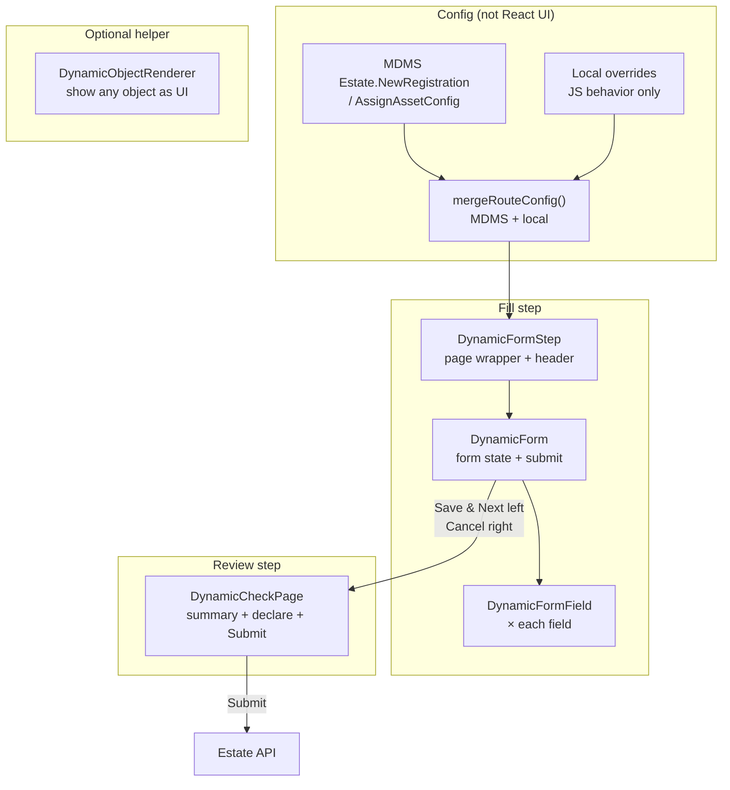
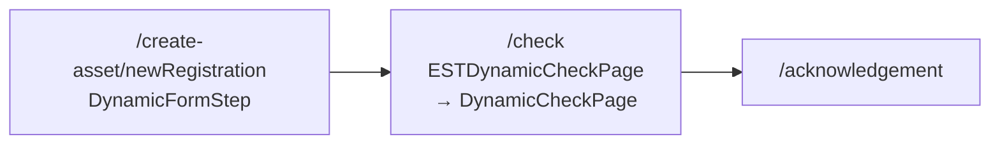
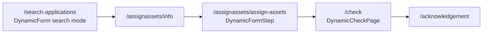

# EST + Dynamic Form — Simple Guide

This explains the shared “Dynamic*” pieces and how the **EST** module uses them.
Read top to bottom. Think of it like a **form wizard**: fill → review → submit.

---

## One-line meanings

| Piece | Simple meaning |
|--------|----------------|
| **DynamicFormField** | Draws **one** input (text, date, dropdown, file…). |
| **DynamicForm** | Draws the **whole form** by looping fields from config. |
| **DynamicFormStep** | One **wizard page**: header + merge MDMS config + DynamicForm. |
| **DynamicCheckPage** | **Review** screen before API submit (read-only summary). |
| **DynamicObjectRenderer** | Pretty-prints any **JSON object** as labels/values (helper UI). |

---

## Big idea (why “dynamic”?)

Fields are **not hardcoded in React**.

1. **MDMS** owns form **shape** (fields, order, labels, validation, dropdown `dataSource`, compute metadata).
2. **Local overrides** add only what JSON cannot express (JS `staticFields`, `computedFields`, `crossFieldValidations`).
3. Components **read that config** and render the UI.

Same engine for **registration**, **assign assets**, and **search**.

### MDMS masters (Estate module)

Source of truth lives in MDMS data (e.g. `data/pg/Estate/`):

| Master | Used for |
|--------|----------|
| `Estate.NewRegistration` | Create-asset wizard (gate fields, plot area, asset type, …) |
| `Estate.AssignAssetConfig` | Allotment / assign-assets wizard |
| `Estate.SearchApplicationConfig` | Employee search filters / table defaults |
| `Estate.CitizenMyApplicationsConfig` | Citizen my-applications filters |
| `Estate.PaymentHistoryConfig` | Citizen payment-history filters / columns |
| Dropdown masters | `AllotmentType`, `AllotmentBillingCycle`, `AssetStatus`, `PaymentStatus`, … |

MDMS PR / repo: `upyog-mdms-data-niuatt` — keep UI + MDMS PRs in sync when changing form structure.

### Local overrides (thin)

| File | Role |
|------|------|
| `config/estateFormConfig.js` | Registration: `staticFields`, `computedFields`, `crossFieldValidations` |
| `config/Create/estateAllotmentFormOverrides.js` | Allotment: `staticFields`, `crossFieldValidations`, page/draft labels |
| `utils/estMdmsUtils.js` | Offline **fallbacks** when MDMS search/citizen/payment configs are empty |

Do **not** duplicate dropdown options or field structure in local JS when MDMS already has them.

---

## Flow chart — how pieces connect



---

## EST employee flows (what you click in the UI)

### A) Create asset (registration)



- MDMS: `Estate.NewRegistration` (includes existing-asset vs new-asset gate + `visibleWhen`)
- Local: `estateFormConfig.js` (payload / cross-field only)
- `ESTNEWRegistration.js` opts in `confirmCancel` and wires existing-asset search via `Digit.ASSETService.search`
- **Save & Next** (left) → session stores values + `routeConfig`
- **Cancel** (right) → optional confirm modal (EST opt-in)
- **Check** → `ESTDynamicCheckPage` → summary → API create

### B) Assign assets (allotment)



- Search uses **DynamicForm** with `mode="search"` (no wizard ActionBar); config from `SearchApplicationConfig`.
- Assign form uses **DynamicFormStep** + MDMS `AssignAssetConfig` + thin `estateAllotmentFormOverrides`.
- Dates use `minDate: "today"` from MDMS; `DynamicFormField` resolves that for DatePicker.
- Identity: **estateNo** (EST-…) vs asset-services **applicationNo / refAssetNo** (PG-…) — never put PG-… into `estateNo` on create.

---

## Each piece in plain English

### 1. DynamicFormField

**Job:** Render **one** field.

- Reads: `fieldConfig` (label, type, validation) + `formData` + `dropdownData`
- Types: text, dropdown, date, file, radio, group, section header
- Supports `minDate: "today"`, `computeFn` / `prefillFrom` / `labelBy`, `numeric`, `maxAmount`
- On change → calls `onChange(name, value)` up to DynamicForm

**Analogy:** One brick.

---

### 2. DynamicForm

**Job:** Own the **form state** and draw all fields.

- Loads dropdown options (`useDynamicMDMS`: MDMS masters, localities, city)
- Maps `routeConfig.form` → many `DynamicFormField`s
- Validates → builds payload → **Save & Next** / **Search** / draft

**Wizard ActionBar (default layout):**

| Side | Buttons |
|------|---------|
| Left | Save & Next (+ Draft when enabled) |
| Right | Cancel |

**`confirmCancel`:** defaults to **`false`** (shared component opt-in). EST registration / assign steps pass `confirmCancel` so Cancel shows a confirmation modal. Cancel reset can skip re-applying `defaultValue` / `prefillFrom` when `resetBaseline` is set (`applyDefaults: false`).

**Modes:**

| Mode | Used in EST for |
|------|------------------|
| `wizard` (default) | Registration / assign-assets |
| `search` | Search applications page |

**Analogy:** The whole wall made of bricks.

---

### 3. DynamicFormStep

**Job:** One **wizard route page**.

1. `mergeRouteConfig(MDMS step, localOverrides)`
2. Show **Header**
3. Render **DynamicForm** (passes through `confirmCancel`, draft, `onFieldSearch`, …)
4. On next → `onSelect(stepKey, data)` and attach `routeConfig` into session

EST wrappers are thin:

- `ESTNEWRegistration.js` → registration step  
- `ESTAssignAssets.js` → allotment step  

**Analogy:** One room in the house (form room).

---

### 4. DynamicCheckPage

**Job:** **Review** before submit (not editable form).

- Uses the **same** `routeConfig.form` to know which labels to show
- Reads saved wizard session values
- Edit icon jumps back to the form step
- Checkbox declaration → **Submit** → parent runs API

EST wrapper: `ESTDynamicCheckPage.js` (picks registration vs allotment payload).

Employee + citizen application details reuse the same summary pattern where possible.

**Analogy:** Checkout / “please confirm” page.

---

### 5. DynamicObjectRenderer

**Job:** Dump any object/array as readable label–value cards.

- **Not** part of the main EST wizard path
- Useful for debugging or showing nested API JSON
- No config, no validation, no submit

**Analogy:** A generic “print this object nicely” widget.

---

## Data flow (registration) — simplest path

```text
MDMS Estate.NewRegistration
    +
estateFormConfig.js  (JS behavior only)
    ↓ merge
routeConfig.form
    ↓
DynamicFormStep  (confirmCancel opt-in)
    ↓
DynamicForm  →  DynamicFormField (each row)
    ↓  Save & Next (left) / Cancel (right)
Session storage (wizard params)
    ↓
DynamicCheckPage (summary)
    ↓  Submit
Estate create API
    ↓
Acknowledgement
```

---

## Where files live

| What | Where |
|------|--------|
| Shared Dynamic* UI | `packages/react-components/src/molecules/` |
| Merge / check helpers | `packages/react-components/src/utilities/checkPageUtils.js`, `formUtils.js`, `validators.js`, `useDynamicMDMS.js` |
| EST registration step | `modules/est/src/PageComponents/ESTNEWRegistration.js` |
| EST assign step | `modules/est/src/PageComponents/ESTAssignAssets.js` |
| EST check wrapper | `modules/est/src/pages/employee/Create/ESTDynamicCheckPage.js` |
| EST local form rules | `modules/est/src/config/estateFormConfig.js`, `Create/estateAllotmentFormOverrides.js` |
| EST MDMS resolve / display helpers | `modules/est/src/utils/estMdmsUtils.js`, `utils/index.js` |
| EST wizards | `modules/est/src/pages/employee/Create/index.js`, `AssignAssetIndex.js` |
| DynamicForm ActionBar styles | `packages/css/src/components/dynamicForm.scss` |
| MDMS Estate JSON | `upyog-mdms-data-niuatt` → `data/pg/Estate/` |

---

## Cheat sheet — “When do I touch what?”

| I want to… | Change… |
|------------|---------|
| Add/rename a field, labels, dropdown master, maxAmount, minDate | MDMS `Estate.NewRegistration` / `AssignAssetConfig` (etc.) |
| Change payload / computed locality / cross-field JS rules | `estateFormConfig.js` / `estateAllotmentFormOverrides.js` |
| Change how one control looks | `DynamicFormField.js` (shared — careful) |
| Change Save & Next / Cancel layout or draft / search bar | `DynamicForm.js` + `dynamicForm.scss` |
| Opt in Cancel confirmation for a step | Pass `confirmCancel` on `DynamicFormStep` / `DynamicForm` |
| Change review layout | `DynamicCheckPage.js` or EST check wrapper |
| Change wizard steps / routes | EST Create pages + MDMS body routes |
| Search / My Apps / Payment History UI config | MDMS `SearchApplicationConfig` / `CitizenMyApplicationsConfig` / `PaymentHistoryConfig` (grid polish may be a later phase) |

---

## Memory tip

```text
MDMS (shape) + local JS (behavior)
        ↓ merge
Config  →  Step (page)  →  Form (state)  →  Field (one input)
                              ↓
                         Check (review)
                              ↓
                            API
```

**DynamicObjectRenderer** sits outside this main path — only for displaying objects.
