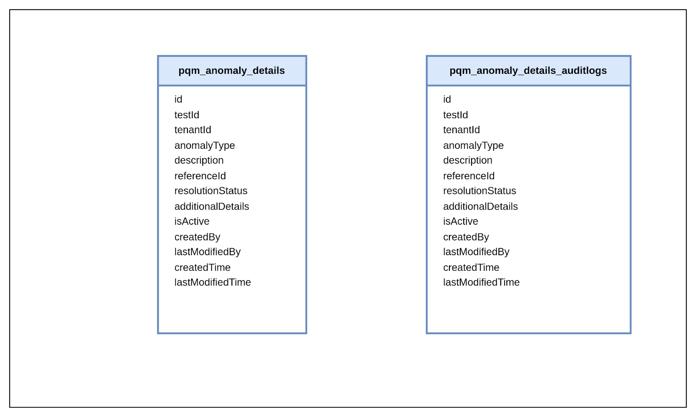

# PQM Anomaly Finder

Process Quality Monitoring Anomaly Finder Service

## DB ER Diagram

## Service Dependencies
- mdms-service
- workflow-v2
- user-service
- user-events
- notification-service

## Service Details
- The Process Quality Management (PQM) anomaly finder service helps in monitoring anomalies in process quality and notifies the concerned user groups.

## Kafka
### Kafka Consumers

- **create-pqm-anomaly-finder** : service receives tests from this topic for which result is failed after quality criteria evaluation

- **testResultNotSubmitted-anomaly-topic** : service receives tests which is not submitted past a certain date from this topic

### Kafka Producers

- **save-pqm-test-anomaly-details** : service sends new anomalies for particular tests to this topic for persistance

- **persist-user-events-async** : service sends new anomalies to be logged as event notifications to this topic
