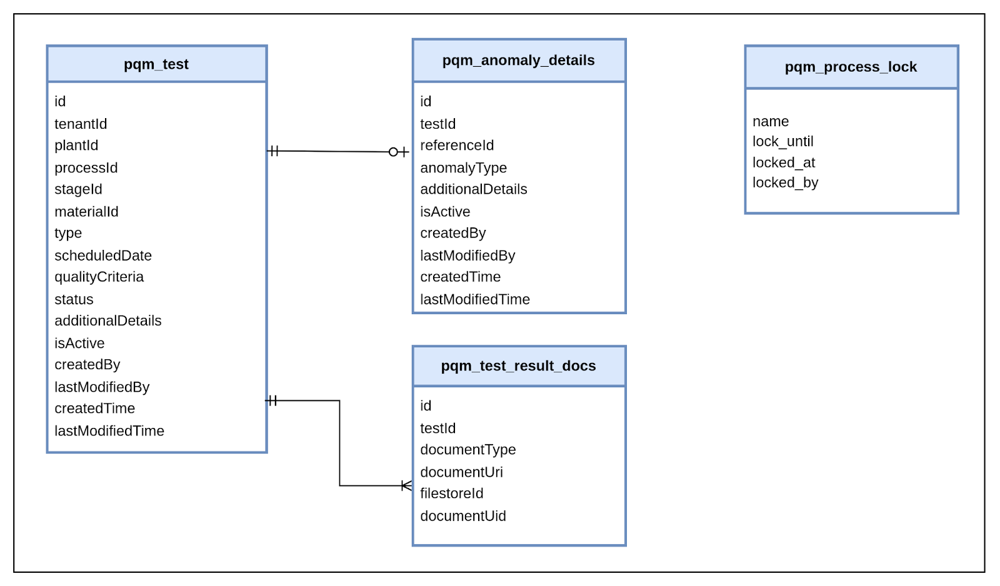

# PQM

Process Quality Monitoring Service

## DB ER Diagram

## Service Dependencies

- mdms-service
- workflow-v2
- user-service
- idgen-service
- user-events
- notification-service
- filestore
- pqm-anomaly-finder

## Swagger API Contract
Link to the swagger API contract [yaml](https://raw.githubusercontent.com/egovernments/municipal-services/master/docs/fsm/Fsm_Apply_Contract.yaml) 

## Postman Collection

## Service Details

- The Process Quality Management (PQM) service will help users to create, update, and search for process quality monitoring tests.
- The service will evaluate the uploaded test values against benchmarks and produce result (FAIL/PASS) status. 
- Test results will be further processed for anomaly analysis. 
- The service can perform two types of test: Manual Test (Lab), and Automatic Test (IoT-based).
- The service also provides functionality of mapping plant codes to plant operators and ULB admins

## API Details

`_create` : This API is used to create adhoc tests

`_search` : This API is used to search for the tests with different search criteria and pagination

`_update` : The _update API is used to update the test result

`_scheduler` : The _scheduler API is used to schedule tests based on MDMS test standards

## Reference Document

TBD

## Kafka

### Kafka Producers
- **save-test-application** : service sends data to this topic to create new Test

- **update-test-application** : service sends data to this topic to update the Test with updatable state of workflow

- **update-workflow-test-application** : service sends data to this topic to update the Test with not updatablestate of workflow

- **save-test-event-application** : service sends new test to this topic for inbox

- **update-test-event-application** : service sends updated test to this topic for inbox
 
- **create-pqm-anomaly-finder** : service sends the test to this topic for which result is failed after quality criteria evaluation

- **testResultNotSubmitted-anomaly-topic** : service sends the test which is not submitted past a certain date to this topic

- **save-plant-user-mapping** : service sends the new plant-user mapping to this topic

- **update-plant-user-mapping** : service sends the updated plant-user mapping to this topic

