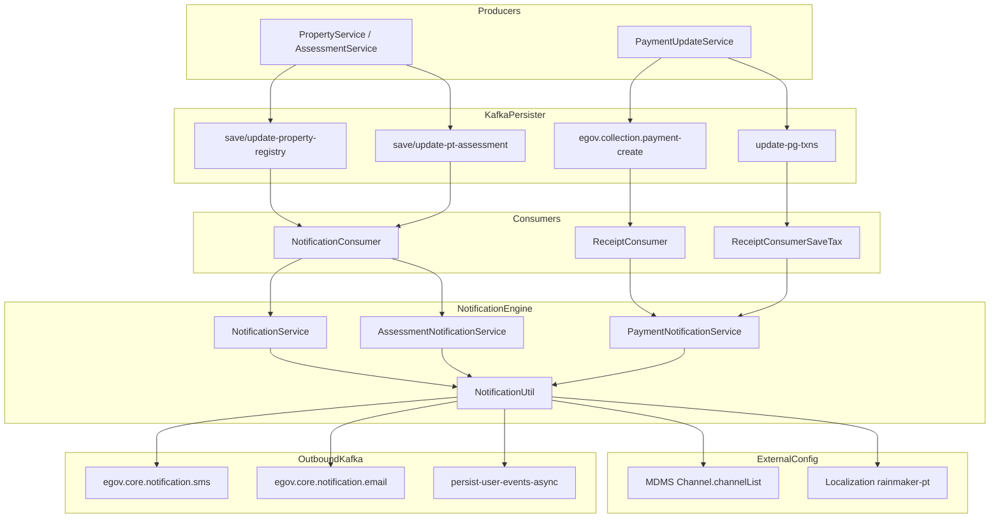

# Property Service (property-services)

Property service creates property and stores in registry on top of which municipal activities like assessment, mutation and amalgamation can be performed. It keeps track of properties and the taxes paid for them.

### DB UML Diagram

NA

### Service Dependencies

- User Service (user)
- ID Gen. Service (ID-GEN)
- Property Tax Calculator Service (pt-calculator)
- MDM Service (MDMS)
- Location Service (Location)
- Localisation Service (localisation)
- Collection Service (payment receipts)
- User Event Service (in-app notifications)

### Swagger API Contract

https://editor.swagger.io/?url=https://raw.githubusercontent.com/upyog/UPYOG/master/municipal-services/docs/property-services/property-services.yml#!/

## Service Details

Creates property, assessment and mutation on existing properties.

### API Details

- **property** — create, update, and mutate properties
- **assessment** — assess a property and pay tax

---

## Notification Architecture

Notifications are **async and Kafka-driven**. Business APIs do not send SMS/email directly; they publish domain events to persister topics. Dedicated consumers resolve workflow state, load MDMS channel config, fetch localization templates, and push to downstream notification topics.

### End-to-end flow



### Key classes

| Class | Package | Responsibility |
|-------|---------|----------------|
| `NotificationConsumer` | `org.egov.pt.consumer` | Kafka entry for property + assessment persister events |
| `ReceiptConsumer` | `org.egov.pt.consumer` | Payment receipt events |
| `ReceiptConsumerSaveTax` | `org.egov.pt.consumer` | PG transaction failure events |
| `NotificationService` | `org.egov.pt.service` | Create / update / mutation / mobile-number notifications |
| `AssessmentNotificationService` | `org.egov.pt.service` | Assessment and dues notifications |
| `PaymentNotificationService` | `org.egov.pt.service` | Online/offline/partial payment notifications |
| `NotificationUtil` | `org.egov.pt.util` | MDMS channels, localization, SMS/email/event dispatch |
| `PTConstants` | `org.egov.pt.util` | Notification codes and channel constants |

### Trigger model

| Trigger | Mechanism | Handler |
|---------|-----------|---------|
| Property create/update/mutation | Kafka persister topic | `NotificationConsumer` → `NotificationService` |
| Assessment create/update | Kafka persister topic | `NotificationConsumer` → `AssessmentNotificationService` |
| Payment receipt | `egov.collection.payment-create` | `ReceiptConsumer` → `PaymentNotificationService` |
| PG payment failure | `update-pg-txns` | `ReceiptConsumerSaveTax` → `PaymentNotificationService` |
| Owner mobile update | Direct service call | `NotificationService.sendNotificationForMobileNumberUpdate()` |

Workflow action (e.g. `OPEN`, `APPROVED`, `PAYMENT_PENDING`) is derived in Java from `ProcessInstance` and used as the MDMS **action** key.

---

## MDMS Configuration

### Channel master (`Channel.channelList`)

Controls which delivery channels are enabled per module and action.

```json
{
  "module": "PT",
  "action": "OPEN",
  "channelNames": ["SMS", "EVENT", "EMAIL"]
}
```

Fetched by `NotificationUtil.fetchChannelList()` using:

- MDMS module: `Channel`
- Master: `channelList`
- Filter fields: `module`, `action`

Common PT module keys: `PT`, `PT.MUTATION`  
Common actions: `OPEN`, `APPROVED`, `PAID`, `ASSESS`, `DUE`, `FAILURE`, `UPDATE_MOBILE`, `PAY`

### Recommended cross-module extension

For new modules (Estate Management, Community Hall Booking), UPYOG is standardizing on MDMS master **`Notification.notificationConfig`**, which extends channel config with:

- `triggerTopic` — Kafka topic that fires the notification
- `triggerField` / `triggerValue` — optional status guard
- `variables` — JSONPath map for `{placeholder}` values
- `messages` — channel-specific templates (`SMS`, `EVENT`, `EMAIL`)
- `recipientMobilePath`, `recipientUuidPath`, `recipientEmailPath`

Property Tax can continue using `Channel.channelList` + localization; new modules can adopt the extended master without Java changes per action.

---

## Localization

Module: **`rainmaker-pt`**

Message codes are selected in Java based on workflow/state, then fetched from the localization service.

| Category | Example codes |
|----------|---------------|
| Create/update workflow | `PT_NOTIF_WF_OPEN`, `PT_NOTIF_WF_APPROVED`, `PT_NOTIF_WF_STATUS_CHANGE` |
| Mutation | `PT_NOTIF_WF_MT_OPEN`, `PT_NOTIF_WF_MT_PAID`, `PT_NOTIF_WF_MT_PAYMENT_PENDING` |
| Payment | `PT_NOTIFICATION_PAYMENT_ONLINE`, `PT_NOTIFICATION_PAYMENT_OFFLINE`, `PT_NOTIFICATION_PAYMENT_FAIL` |
| Assessment | `ASMT_CREATE`, `ASMT_UPDATE`, `ASMT_MSG_{workflowState}` |
| Other | `PT_UPDATE_OWNER_NUMBER`, `DUES_NOTIFICATION` |

Templates use placeholders such as `{ownerName}`, property links, and pay-now URLs replaced in `NotificationService`.

---

## Kafka Topics

### Persister consumers (notification entry)

| Property | Default topic |
|----------|---------------|
| `persister.save.property.topic` | `save-property-registry` |
| `persister.update.property.topic` | `update-property-registry` |
| `egov.pt.assessment.create.topic` | `save-pt-assessment` |
| `egov.pt.assessment.update.topic` | `update-pt-assessment` |

Notification consumer pattern (single listener, multiple topics):

```
pt.kafka.notification.topic.pattern=((^[a-zA-Z]+-)?save-pt-assessment|(^[a-zA-Z]+-)?update-pt-assessment|(^[a-zA-Z]+-)?save-property-registry|(^[a-zA-Z]+-)?update-property-registry)
```

### Payment / PG consumers

| Property | Default topic |
|----------|---------------|
| `kafka.topics.receipt.create` | `egov.collection.payment-create` |
| `kafka.topics.notification.pg.save.txns` | `update-pg-txns` |

### Outbound notification producers

| Property | Default topic | Channel |
|----------|---------------|---------|
| `kafka.topics.notification.sms` | `egov.core.notification.sms` | SMS |
| `kafka.topics.notification.email` | `egov.core.notification.email` | Email |
| `egov.usr.events.create.topic` | `persist-user-events-async` | In-app events |

### Feature flags

```
notif.sms.enabled=true
notif.email.enabled=true
egov.user.event.notification.enabled=true
```

---

## Adding a new Property Tax notification

1. **MDMS** — add `Channel.channelList` row with `module`, `action`, `channelNames`
2. **Localization** — add message code under `rainmaker-pt` (e.g. `PT_NOTIF_WF_NEW_STATE`)
3. **Java** — map workflow/state to the new action and localization code in `NotificationService` or `PaymentNotificationService`
4. **Verify** — confirm the persister or payment Kafka topic is already consumed by the relevant consumer

For config-only modules (no Java change per action), use the **`Notification.notificationConfig`** pattern implemented in `estate-management` (`upyog.notification.*`).

---

## Related modules

| Module | Notification approach |
|--------|----------------------|
| **property-services** | Kafka + MDMS channels + localization (this service) |
| **community-hall-booking** | Kafka persister consumer + MDMS channels + `rainmaker-chb` |
| **estate-management** | Kafka persister consumer + full MDMS config (channels, messages, variables) |
