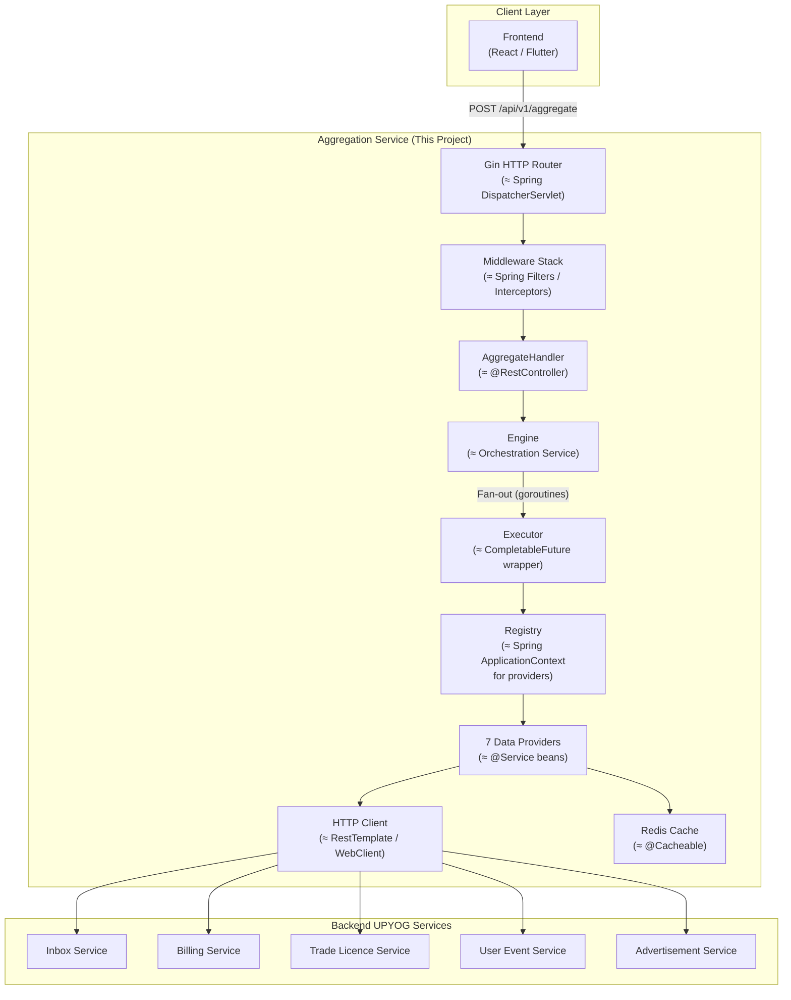
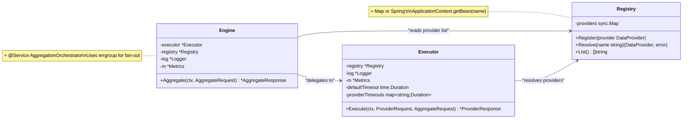
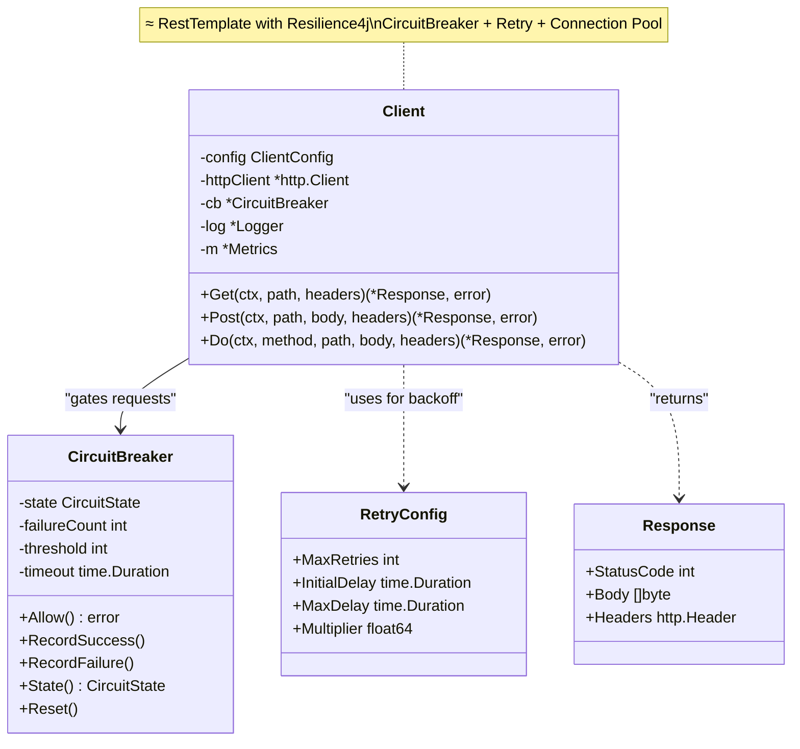
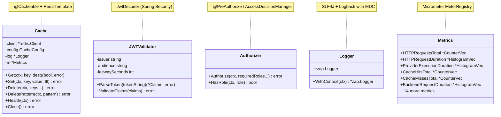
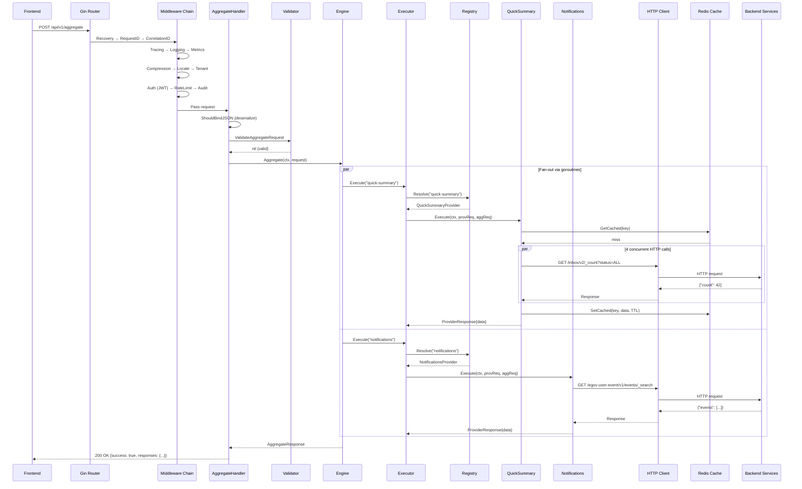
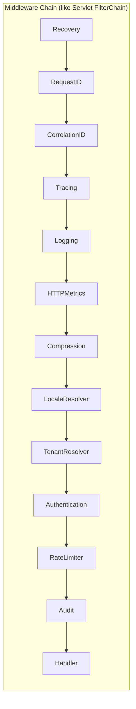
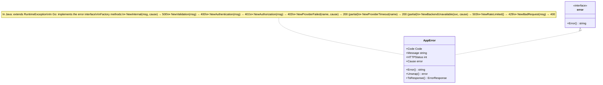

# UPYOG Aggregation Service — Complete Project Documentation

> **Audience**: Java developers (12+ years experience) learning Go for the first time.
> Every Go concept is explained with its Java equivalent.

---

## 1. What Does This Service Do?

The **UPYOG Aggregation Service** is a **Backend-For-Frontend (BFF)** microservice written in Go. It receives a single API call from the frontend and **fans out** to multiple backend UPYOG services (inbox, billing, user-events, trade-licence, advertisements) **concurrently**, then merges all responses into one JSON payload.

> **Java analogy**: Think of it as a Spring Boot `@RestController` that uses `CompletableFuture.allOf()` to call 7 downstream microservices in parallel, then combines them into a single response DTO.

---

## 2. High-Level Architecture



---

## 3. Project Structure — Package Map

> [!TIP]
> In Go, the directory structure **IS** the package structure. There are no `pom.xml` or `build.gradle` — just `go.mod`.
> Each directory = one package. No two files in the same directory can have different `package` declarations.

```
upyog-aggregation-service/
├── main.go                          ← Entry point (≈ SpringApplication.run())
├── go.mod                           ← Dependencies (≈ pom.xml / build.gradle)
├── go.sum                           ← Dependency checksums (≈ lockfile)
│
├── api/                             ← HTTP handlers (≈ @RestController layer)
│   ├── router.go                    ← Route registration (≈ WebMvcConfigurer)
│   ├── aggregate_handler.go         ← POST /api/v1/aggregate handler
│   └── health_handler.go            ← /health, /readiness, /liveness
│
├── internal/                        ← Private packages (cannot be imported externally)
│   ├── aggregation/
│   │   ├── engine/engine.go         ← Orchestrator (fans out to providers)
│   │   ├── executor/executor.go     ← Single-provider executor with timeout
│   │   └── registry/registry.go     ← Provider lookup map (≈ ApplicationContext)
│   │
│   ├── auth/
│   │   ├── jwt.go                   ← JWT parsing & claims validation
│   │   └── authorizer.go            ← RBAC role checking
│   │
│   ├── cache/
│   │   └── redis.go                 ← Redis cache with JSON ser/deser
│   │
│   ├── clients/
│   │   ├── client.go                ← Resilient HTTP client
│   │   ├── circuit_breaker.go       ← Circuit breaker pattern
│   │   └── retry.go                 ← Exponential backoff retry
│   │
│   ├── common/
│   │   ├── constants.go             ← Shared constants (≈ Constants.java)
│   │   └── context.go               ← Context value helpers (≈ ThreadLocal)
│   │
│   ├── config/
│   │   ├── config.go                ← Config structs (≈ @ConfigurationProperties)
│   │   └── loader.go                ← Viper config loading (≈ Spring Environment)
│   │
│   ├── dto/
│   │   ├── request.go               ← Request DTOs (≈ RequestBody POJO)
│   │   └── response.go              ← Response DTOs (≈ ResponseBody POJO)
│   │
│   ├── errors/
│   │   └── errors.go                ← Error types & codes (≈ custom exceptions)
│   │
│   ├── mapper/
│   │   └── mapper.go                ← JSON deep-copy & safe accessors
│   │
│   ├── metrics/
│   │   └── metrics.go               ← Prometheus counters/histograms
│   │
│   ├── middleware/                   ← 13 HTTP middlewares (≈ Servlet Filters)
│   │   ├── recovery.go              ← Panic recovery (≈ @ExceptionHandler)
│   │   ├── requestid.go             ← X-Request-Id propagation
│   │   ├── correlationid.go         ← X-Correlation-Id propagation
│   │   ├── tracing.go               ← OpenTelemetry span creation
│   │   ├── logging.go               ← Structured request logging
│   │   ├── metrics.go               ← HTTP metrics recording
│   │   ├── compression.go           ← Gzip response compression
│   │   ├── locale.go                ← Accept-Language resolution
│   │   ├── tenant.go                ← Multi-tenant ID resolution
│   │   ├── auth.go                  ← JWT Bearer token validation
│   │   ├── authorization.go         ← RBAC middleware
│   │   ├── ratelimit.go             ← Token-bucket rate limiter
│   │   └── audit.go                 ← Audit trail logging
│   │
│   ├── providers/                   ← Data providers (the "business logic")
│   │   ├── provider.go              ← DataProvider interface + BaseProvider
│   │   ├── quick_summary.go         ← Aggregated counts (apps, payments, etc.)
│   │   ├── recent_applications.go   ← Recent inbox applications
│   │   ├── notifications.go         ← User notifications/events
│   │   ├── draft_applications.go    ← Saved draft applications
│   │   ├── due_renewals.go          ← Licences nearing expiry
│   │   ├── upcoming_events.go       ← Future public events
│   │   └── advertisement_banners.go ← Ad banners
│   │
│   ├── tracing/
│   │   └── tracing.go               ← OpenTelemetry setup
│   │
│   └── validator/
│       └── validator.go             ← Request validation rules
│
├── pkg/
│   └── logger/
│       └── logger.go                ← Zap structured logger
│
├── configs/                         ← YAML config files per environment
├── deployments/                     ← Docker Compose + K8s manifests
├── scripts/                         ← Build/test helper scripts
└── test/                            ← Tests, fixtures, mocks
```

---

## 4. Class Diagram (Go Structs ≈ Java Classes)

> [!NOTE]
> Go has no classes, inheritance, or constructors. Instead it uses **structs** (data) + **methods** (behavior) + **interfaces** (contracts) + **embedding** (composition over inheritance).

### 4.1 Core Domain Model

```mermaid
classDiagram
    direction TB

    class DataProvider {
        <<interface>>
        +Name() string
        +Execute(ctx, ProviderRequest, AggregateRequest) (*ProviderResponse, error)
    }

    class BaseProvider {
        -providerName string
        +Client *Client
        +Cache *Cache
        +Log *Logger
        +Metrics *Metrics
        +CacheTTL time.Duration
        +Name() string
        +BuildCacheKey(tenantID, parts...) string
        +GetCached(ctx, key, dest) (bool, error)
        +SetCached(ctx, key, value, ttl) error
    }

    class QuickSummaryProvider {
        +Execute(ctx, ProviderRequest, AggregateRequest) (*ProviderResponse, error)
        -fetchCount(ctx, path, headers) (int, error)
    }

    class RecentApplicationsProvider {
        +Execute(ctx, ProviderRequest, AggregateRequest) (*ProviderResponse, error)
        -buildSearchPath(request) string
    }

    class NotificationsProvider {
        +Execute(ctx, ProviderRequest, AggregateRequest) (*ProviderResponse, error)
    }

    class DraftApplicationsProvider {
        +Execute(ctx, ProviderRequest, AggregateRequest) (*ProviderResponse, error)
        -buildSearchPath(request, tenantID) string
    }

    class DueRenewalsProvider {
        +Execute(ctx, ProviderRequest, AggregateRequest) (*ProviderResponse, error)
    }

    class UpcomingEventsProvider {
        +Execute(ctx, ProviderRequest, AggregateRequest) (*ProviderResponse, error)
    }

    class AdvertisementBannersProvider {
        +Execute(ctx, ProviderRequest, AggregateRequest) (*ProviderResponse, error)
    }

    DataProvider <|.. BaseProvider : "partially implements (Name)"
    BaseProvider <|-- QuickSummaryProvider : "embeds (≈ extends)"
    BaseProvider <|-- RecentApplicationsProvider : "embeds"
    BaseProvider <|-- NotificationsProvider : "embeds"
    BaseProvider <|-- DraftApplicationsProvider : "embeds"
    BaseProvider <|-- DueRenewalsProvider : "embeds"
    BaseProvider <|-- UpcomingEventsProvider : "embeds"
    BaseProvider <|-- AdvertisementBannersProvider : "embeds"

    note for DataProvider "In Java: public interface DataProvider\nIn Go: any struct with Name() and Execute() methods\nautomatically satisfies this interface (duck typing)"

    note for BaseProvider "In Java: public abstract class BaseProvider implements DataProvider\nIn Go: a struct that concrete providers embed"
```



### 4.2 Aggregation Pipeline



### 4.3 HTTP Client + Resilience



### 4.4 Infrastructure Layer



---

## 5. Request Flow — Step by Step



---

## 6. Entity Details — What Each Package Does

### 6.1 `main.go` — The Entry Point

| Java Equivalent | `public static void main()` + `SpringApplication.run()` |
|---|---|

**What it does**:
1. Creates the logger (≈ configuring Logback)
2. Loads config from YAML via Viper (≈ `@Value` / `@ConfigurationProperties`)
3. Initializes OpenTelemetry tracing (≈ Spring Cloud Sleuth)
4. Creates Prometheus metrics registry (≈ Micrometer)
5. Connects to Redis (≈ `@EnableCaching` + `RedisConnectionFactory`)
6. Registers custom validators (≈ `@InitBinder`)
7. Creates the provider registry and registers all 7 providers (≈ `@ComponentScan`)
8. Builds the executor and engine (≈ `@Bean` factory methods)
9. Creates the JWT validator and authorizer (≈ Spring Security config)
10. Sets up the Gin router with middleware (≈ `SecurityFilterChain` + `FilterRegistrationBean`)
11. Starts the HTTP server with graceful shutdown (≈ embedded Tomcat)

> [!IMPORTANT]
> **Key difference from Spring**: In Go, there is **no dependency injection container**. You manually construct and wire everything in `main()`. This is called **"manual DI"** or **"poor man's DI"** and is considered idiomatic Go.

---

### 6.2 `api/` — HTTP Handlers

#### `router.go` — Route Registration
| Java Equivalent | `WebMvcConfigurer` + `SecurityFilterChain` |
|---|---|

Registers all middleware in order, then mounts health endpoints and API routes. The middleware order matters (just like `FilterOrderRegistration` in Spring).

**Middleware execution order** (top-to-bottom on request, bottom-to-top on response):
```
1. Recovery        — catches panics (≈ @ExceptionHandler for uncaught errors)
2. RequestID       — assigns/propagates X-Request-Id
3. CorrelationID   — assigns/propagates X-Correlation-Id
4. Tracing         — creates OpenTelemetry span
5. Logging         — logs method, path, status, latency
6. HTTPMetrics     — records Prometheus counters
7. Compression     — gzip (conditional)
8. LocaleResolver  — extracts Accept-Language
9. TenantResolver  — extracts X-Tenant-Id
10. Authentication — JWT validation (conditional)
11. RateLimiter    — token-bucket (conditional)
12. Audit          — logs POST/PUT/PATCH/DELETE
```

#### `aggregate_handler.go` — The Main Endpoint
| Java Equivalent | `@PostMapping("/api/v1/aggregate")` |
|---|---|

1. Binds JSON body to `AggregateRequest` struct (≈ `@RequestBody`)
2. Validates with custom validator (≈ `@Valid` + custom `ConstraintValidator`)
3. Delegates to `Engine.Aggregate()` (≈ calling `@Service`)
4. Returns JSON response (≈ `ResponseEntity.ok()`)

#### `health_handler.go` — Health Probes
| Java Equivalent | Spring Boot Actuator `/actuator/health` |
|---|---|

Three endpoints for Kubernetes:
- `/health` — always UP
- `/readiness` — checks Redis connectivity
- `/liveness` — always UP (lightweight)

---

### 6.3 `internal/aggregation/` — The Core Pipeline

#### `registry/registry.go` — Provider Registry
| Java Equivalent | `Map<String, DataProvider>` or `ApplicationContext.getBean()` |
|---|---|

Uses `sync.Map` (thread-safe map) to store providers by name. Providers are registered at startup, resolved at request time.

```go
// Go                                    // Java equivalent
reg.Register(provider)                   // context.registerBean("name", provider)
provider, err := reg.Resolve("name")     // context.getBean("name", DataProvider.class)
```

#### `executor/executor.go` — Single-Provider Executor
| Java Equivalent | `CompletableFuture` wrapper with timeout + metrics |
|---|---|

For each provider request:
1. Resolves the provider from the registry
2. Creates a **per-provider timeout** using `context.WithTimeout` (≈ `orTimeout()`)
3. Creates a tracing span
4. Executes the provider
5. Records duration, status, and error metrics
6. Translates errors → appropriate `ProviderResponse` status

#### `engine/engine.go` — Fan-Out Orchestrator
| Java Equivalent | `CompletableFuture.allOf()` |
|---|---|

Uses `errgroup.WithContext` to launch one goroutine per provider request. All goroutines run concurrently. Results are collected in a `sync.Map` and merged into a single `AggregateResponse`.

```go
// Go (this project)                          // Java equivalent
g, gCtx := errgroup.WithContext(ctx)          // List<CompletableFuture<>> futures
for _, pr := range req.Requests {             // for (ProviderRequest pr : req.getRequests())
    g.Go(func() error {                       //     futures.add(CompletableFuture.supplyAsync(() -> {
        resp := e.executor.Execute(gCtx, pr)  //         return executor.execute(pr);
        results.Store(pr.Provider, resp)       //     }));
        return nil                            //
    })                                        //
}                                             //
_ = g.Wait()                                  // CompletableFuture.allOf(futures).join()
```

---

### 6.4 `internal/providers/` — Data Providers (Business Logic)

#### `provider.go` — Interface + Base
| Java Equivalent | `interface DataProvider` + `abstract class BaseProvider` |
|---|---|

**`DataProvider` interface** — the contract:
```go
// Go                                     // Java
type DataProvider interface {             // public interface DataProvider {
    Name() string                         //     String getName();
    Execute(ctx, req, aggReq)             //     ProviderResponse execute(ctx, req, aggReq);
        (*ProviderResponse, error)        // }
}
```

**`BaseProvider` struct** — shared infrastructure:
```go
type BaseProvider struct {                // public abstract class BaseProvider
    providerName string                   //     implements DataProvider {
    Client       *clients.Client          //     private final RestTemplate client;
    Cache        *cache.Cache             //     private final RedisTemplate cache;
    Log          *logger.Logger           //     private final Logger log;
    Metrics      *metrics.Metrics         //     private final MeterRegistry metrics;
    CacheTTL     time.Duration            //     private final Duration cacheTTL;
}                                         // }
```

#### Provider Implementations

| Provider | What It Fetches | Backend API Called |
|----------|----------------|-------------------|
| `QuickSummaryProvider` | 4 aggregate counts (apps, payments, completed, drafts) | `/egov-workflow-v2/egov-wf/process/dashboard/_count`, `/billing-service/bill/v2/short/_search` |
| `RecentApplicationsProvider` | Paginated recent applications | `/egov-workflow-v2/egov-wf/process/_search` |
| `NotificationsProvider` | User notifications, optional unread filter | `/egov-user-event/v1/events/_search` |
| `DraftApplicationsProvider` | Draft (unsubmitted) applications | `/upyog-draft-service/draft/v1/_search` |
| `DueRenewalsProvider` | Bills/licences nearing expiry | `/billing-service/bill/v2/short/_search` |
| `UpcomingEventsProvider` | Future public events | `/egov-user-event/v1/events/_search?eventType=EVENTSONGROUND` |
| `AdvertisementBannersProvider` | Ad banners with optional placement filter | `/advertisement-service/v1/advertisements/_search` |

> [!NOTE]
> `QuickSummaryProvider` is the most complex — it launches **4 nested goroutines** within its own `Execute()` to fetch all 4 counts concurrently. It also uses caching.

---

### 6.5 `internal/clients/` — Resilient HTTP Client

| Java Equivalent | `WebClient` + Resilience4j (`@Retry` + `@CircuitBreaker`) |
|---|---|

#### `client.go` — The HTTP Client
Features:
- **Connection pooling** via `http.Transport` (≈ Apache `PoolingHttpClientConnectionManager`)
- **Keep-alive** with configurable idle timeout
- **JWT propagation** — forwards the bearer token from context
- **Request/Correlation ID propagation** — forwards tracing headers
- **Retry with backoff** — delegates to `Retry()` function
- **Circuit breaker** — wraps each call in `cb.Allow()` / `cb.RecordSuccess/Failure()`
- **Distributed tracing** — creates a child span per HTTP call
- **Prometheus metrics** — records duration, count, retries

#### `circuit_breaker.go` — Circuit Breaker Pattern
| Java Equivalent | Resilience4j `CircuitBreaker` |
|---|---|

Three states: **Closed** → **Open** → **Half-Open** → Closed.
- Opens after N consecutive failures
- Auto-transitions to half-open after timeout
- A single probe success in half-open → closes the circuit

#### `retry.go` — Exponential Backoff
| Java Equivalent | Resilience4j `Retry` or Spring Retry `@Retryable` |
|---|---|

- Exponential backoff with jitter (random 0–50% of delay)
- Retries only on network errors and 5xx backend errors
- Respects `context.Done()` cancellation between attempts

---

### 6.6 `internal/cache/` — Redis Cache

| Java Equivalent | `@Cacheable` + `RedisTemplate<String, String>` |
|---|---|

- JSON serialization/deserialization for cache values
- Tenant-scoped cache keys: `agg:{tenantID}:{provider}:{extra}`
- Pattern-based cache invalidation via `SCAN` (avoids blocking `KEYS *`)
- Health check via `PING`
- Metrics: hit/miss/error counters per provider

---

### 6.7 `internal/middleware/` — 13 HTTP Middlewares

| Java Equivalent | `javax.servlet.Filter` / Spring `HandlerInterceptor` |
|---|---|



| Middleware | What It Does | Java Equivalent |
|-----------|-------------|----------------|
| `Recovery` | Catches panics, returns 500 | `@ExceptionHandler` for uncaught |
| `RequestID` | Generates/propagates X-Request-Id | `MDC.put("requestId")` |
| `CorrelationID` | Generates/propagates X-Correlation-Id | `MDC.put("correlationId")` |
| `Tracing` | Creates OpenTelemetry span | Spring Cloud Sleuth `TracingFilter` |
| `Logging` | Logs method, path, status, latency | `CommonsRequestLoggingFilter` |
| `HTTPMetrics` | Records request count/duration/size | Micrometer `WebMvcMetricsFilter` |
| `Compression` | Gzip response if client accepts | `GzipFilter` |
| `LocaleResolver` | Extracts Accept-Language | `LocaleResolver` |
| `TenantResolver` | Extracts X-Tenant-Id header | Custom `TenantFilter` |
| `Authentication` | Validates JWT Bearer token | `BearerTokenAuthenticationFilter` |
| `RateLimiter` | Token-bucket rate limiting | Spring Cloud Gateway `RequestRateLimiter` |
| `Audit` | Logs POST/PUT/PATCH/DELETE ops | Custom `AuditFilter` |
| `Authorization` | RBAC role check (defined, unused) | `@PreAuthorize("hasRole(...)")` |

---

### 6.8 `internal/config/` — Configuration Management

| Java Equivalent | `@ConfigurationProperties` + `application.yml` |
|---|---|

Uses **Viper** (the Go equivalent of Spring's property management):
- Reads `configs/application-{env}.yaml` based on `APP_ENV`
- Supports env var overrides with `UPYOG_` prefix
- Nested struct mapping via `mapstructure` tags (≈ `@ConfigurationProperties(prefix = "...")`)

**Config hierarchy**:
```
Config
├── ServerConfig        (port, timeouts, compression)
├── RedisConfig         (host, port, pool, timeouts)
├── AuthConfig          (issuer, audience, public paths)
├── ObservabilityConfig
│   ├── MetricsConfig   (namespace, subsystem)
│   └── TracingConfig   (endpoint, sampling rate)
├── ProvidersConfig     (default timeout, cache TTL, per-provider overrides)
├── BackendConfig       (per-service base URLs)
└── RateLimitConfig     (requests/sec, burst)
```

---

### 6.9 `internal/errors/` — Error Types

| Java Equivalent | Custom exception hierarchy (`extends RuntimeException`) |
|---|---|



> [!IMPORTANT]
> **Critical difference**: Go has no exceptions or try/catch. Errors are **returned as values** (`return nil, err`). Every function that can fail returns `(result, error)`. You check `if err != nil` instead of catching exceptions.

---

### 6.10 `pkg/logger/` — Structured Logging

| Java Equivalent | SLF4J + Logback + MDC |
|---|---|

Built on **Zap** (high-performance structured logger). The `WithContext(ctx)` method automatically enriches every log line with:
- `requestId` (≈ `MDC.get("requestId")`)
- `traceId`
- `correlationId`
- `tenantId`
- `provider`

```go
// Go usage                              // Java equivalent
log.WithContext(ctx).Info("message",      // log.info("message requestId={} tenantId={}",
    zap.String("key", "value"),           //     MDC.get("requestId"), MDC.get("tenantId"));
)
```

---

## 7. Go Features Used — Mapped to Java

### 7.1 Goroutines & Channels (≈ Virtual Threads / CompletableFuture)

**Go Feature**: `go func()` launches a lightweight concurrent function (goroutine).
Goroutines cost ~2KB of stack (vs ~1MB for Java threads). You can launch millions.

```go
// Go: launch concurrent work                    // Java: CompletableFuture
g, ctx := errgroup.WithContext(ctx)               // List<CompletableFuture<Void>> futures = new ArrayList<>();
for _, req := range requests {                    // for (Request req : requests) {
    g.Go(func() error {                           //     futures.add(CompletableFuture.runAsync(() -> {
        result := doWork(ctx, req)                //         Result result = doWork(req);
        results.Store(req.Name, result)            //         results.put(req.getName(), result);
        return nil                                //     }));
    })                                            // }
}                                                 //
_ = g.Wait()                                      // CompletableFuture.allOf(futures).join();
```

**Used in**: `engine.go` (fan-out), `quick_summary.go` (4 concurrent counts)

---

### 7.2 `context.Context` (≈ ThreadLocal + CancellationToken)

**Go Feature**: `context.Context` is passed through every function call and carries:
- **Deadlines/timeouts** (≈ `CompletableFuture.orTimeout()`)
- **Cancellation signals** (≈ `Future.cancel()`)
- **Request-scoped values** (≈ `ThreadLocal` / Spring `RequestAttributes`)

```go
// Go                                             // Java
ctx, cancel := context.WithTimeout(ctx, 10s)      // ExecutorService.submit().get(10, SECONDS)
defer cancel()                                    // // auto-cleanup
value := ctx.Value(key)                           // ThreadLocal.get() / RequestContextHolder
```

**Used everywhere** — every function accepts `ctx context.Context` as its first parameter.

> [!WARNING]
> Unlike Java's `ThreadLocal`, Go's `context.Context` is **explicitly passed** as a function argument. It is NEVER global or implicit. This is a fundamental difference.

---

### 7.3 Interfaces (≈ Java Interfaces, but Duck-Typed)

**Go Feature**: Interfaces are **implicitly satisfied**. No `implements` keyword needed.

```go
// Go: define interface                           // Java: same concept
type DataProvider interface {                     // public interface DataProvider {
    Name() string                                 //     String getName();
    Execute(ctx, req, agg) (*Resp, error)         //     Response execute(ctx, req, agg);
}                                                 // }

// Go: satisfy interface (NO "implements" keyword) // Java: must explicitly declare
type QuickSummaryProvider struct{ BaseProvider }   // class QuickSummaryProvider
func (p *QuickSummaryProvider) Execute(...) {...}  //     implements DataProvider { ... }
```

**Key insight**: If a struct has the right methods, it **automatically** satisfies the interface. This is called **"duck typing"** — "if it walks like a duck and quacks like a duck..."

**Used in**: `DataProvider` interface, `error` interface, `http.Flusher` interface

---

### 7.4 Struct Embedding (≈ Composition / `extends`)

**Go Feature**: Go has **no inheritance**. Instead, you embed one struct inside another.

```go
// Go: embedding                                  // Java: inheritance
type BaseProvider struct {                        // public abstract class BaseProvider {
    Client  *clients.Client                       //     protected RestTemplate client;
    Cache   *cache.Cache                          //     protected RedisTemplate cache;
}                                                 // }

type QuickSummaryProvider struct {                 // public class QuickSummaryProvider
    BaseProvider  // embedded, not a field         //     extends BaseProvider {
}                                                 // }

// Methods are "promoted" — you can call:
provider.Name()       // calls BaseProvider.Name()
provider.Client.Get() // accesses BaseProvider.Client
```

**Used in**: All 7 providers embed `BaseProvider`, `gzipResponseWriter` embeds `gin.ResponseWriter`

---

### 7.5 Multiple Return Values (≈ Tuple / Either)

**Go Feature**: Functions return multiple values. The `(result, error)` pattern is universal.

```go
// Go                                             // Java
func ParseToken(s string) (*Claims, error) {      // public Either<AuthError, Claims> parseToken(String s) {
    // ...                                        //     // ...
    if err != nil {                               //     if (error) {
        return nil, errors.New("bad token")       //         return Either.left(new AuthError("bad token"));
    }                                             //     }
    return &claims, nil                           //     return Either.right(claims);
}                                                 // }

// Caller:                                        // Caller:
claims, err := v.ParseToken(token)                // Either<AuthError, Claims> result = v.parseToken(token);
if err != nil {                                   // if (result.isLeft()) {
    return err                                    //     throw result.getLeft();
}                                                 // }
```

**Used everywhere** — this is the #1 most common Go pattern.

---

### 7.6 `defer` (≈ try-finally / AutoCloseable)

**Go Feature**: `defer` schedules a function call to run when the current function returns.

```go
// Go                                             // Java
func doWork() {                                   // void doWork() {
    f, err := os.Open("file")                     //     var f = new FileInputStream("file");
    if err != nil { return }                      //     try {
    defer f.Close()  // runs when doWork() exits  //         // ... use f ...
    // ... use f ...                              //     } finally {
}                                                 //         f.close();
                                                  //     }
                                                  // }
```

**Used in**: `main.go` (logger sync, tracer shutdown, cache close), `executor.go` (span.End(), cancel()), `client.go` (response body close)

---

### 7.7 `sync.Map` (≈ `ConcurrentHashMap`)

**Go Feature**: Thread-safe map for concurrent read/write.

```go
// Go                                             // Java
var m sync.Map                                    // ConcurrentHashMap<String, Object> m = new ConcurrentHashMap<>();
m.Store("key", value)                             // m.put("key", value);
v, ok := m.Load("key")                            // Object v = m.get("key"); // check null
m.Range(func(k, v any) bool {                     // m.forEach((k, v) -> {
    // iterate                                    //     // iterate
    return true                                   // });
})
```

**Used in**: `registry.go` (provider storage), `engine.go` (result collection)

---

### 7.8 `sync.Pool` (≈ Object Pool Pattern)

**Go Feature**: Reusable object pool to reduce GC pressure.

```go
// Go                                             // Java
var pool = sync.Pool{                             // ObjectPool<GzipWriter> pool =
    New: func() interface{} {                     //     new GenericObjectPool<>(new GzipWriterFactory());
        w, _ := gzip.NewWriterLevel(...)          //
        return w                                  //
    },                                            //
}                                                 //
gz := pool.Get().(*gzip.Writer)                   // GzipWriter gz = pool.borrowObject();
defer pool.Put(gz)                                // pool.returnObject(gz);
```

**Used in**: `compression.go` (reusing gzip writers)

---

### 7.9 Struct Tags (≈ Annotations)

**Go Feature**: Metadata attached to struct fields via backtick strings.

```go
// Go                                             // Java
type AggregateRequest struct {                    // public class AggregateRequest {
    RequestID string `json:"requestId"            //     @JsonProperty("requestId")
                      binding:"required,uuid"`    //     @NotNull @UUID
    Page      string `json:"page"                 //     private String requestId;
                      binding:"required,min=1"`   //
    TenantID  string `json:"tenantId"             //     @JsonProperty("page")
                      binding:"required"`          //     @NotBlank @Size(min=1)
}                                                 //     private String page;
                                                  //     // ... etc
```

| Go Tag | Java Equivalent | Purpose |
|--------|----------------|---------|
| `` `json:"fieldName"` `` | `@JsonProperty("fieldName")` | JSON serialization name |
| `` `json:",omitempty"` `` | `@JsonInclude(NON_NULL)` | Skip if zero value |
| `` `binding:"required"` `` | `@NotNull` | Gin validation |
| `` `binding:"min=1,max=128"` `` | `@Size(min=1, max=128)` | Gin validation |
| `` `binding:"uuid"` `` | `@UUID` (custom) | Gin validation |
| `` `mapstructure:"key"` `` | `@Value("${key}")` | Viper config binding |

---

### 7.10 Error Wrapping (≈ Exception Chaining)

**Go Feature**: `fmt.Errorf("message: %w", err)` wraps errors with context.

```go
// Go                                             // Java
return fmt.Errorf("GET %s: %w", path, err)        // throw new ServiceException("GET " + path, cause);
// Unwrapping:                                    // Unwrapping:
if errors.Is(err, context.DeadlineExceeded) {     // if (ex.getCause() instanceof TimeoutException) {
    // handle timeout                             //     // handle timeout
}                                                 // }
var appErr *AppError                              // if (ex instanceof AppError appErr) {
if errors.As(err, &appErr) {                      //     // use appErr
    // use appErr                                 // }
}
```

**Used in**: `client.go`, all providers, `cache/redis.go`

---

### 7.11 Generics (Go 1.18+)

**Go Feature**: Type parameters (added in Go 1.18, similar to Java generics since Java 5).

```go
// Go                                             // Java
func MapSlice[T any, R any](                      // <T, R> List<R> mapSlice(
    source []T,                                   //     List<T> source,
    fn func(T) R,                                 //     Function<T, R> fn
) []R {                                           // ) {
    result := make([]R, len(source))              //     return source.stream()
    for i, v := range source {                    //         .map(fn)
        result[i] = fn(v)                         //         .collect(toList());
    }                                             // }
    return result
}
```

**Used in**: `mapper.go` (`MapSlice` generic function)

---

### 7.12 The `internal/` Directory Convention

**Go Feature**: Packages under `internal/` **cannot be imported** by external modules. This is enforced by the Go compiler.

```
// This is a Go-specific visibility rule:
// github.com/upyog/upyog-aggregation-service/internal/cache
//   ↑ can ONLY be imported by code within upyog-aggregation-service
//   ↑ external projects CANNOT import it

// Java equivalent: package-private classes, or Java 9 modules with
// "exports" directives in module-info.java
```

---

### 7.13 `init()` Functions (≈ Static Initializer Blocks)

While not heavily used in this project, Go has `init()` functions that run automatically before `main()`:

```go
// Go                                             // Java
func init() {                                     // static {
    // runs before main()                         //     // runs when class is loaded
}                                                 // }
```

---

## 8. Key Go Idioms for Java Developers

### 8.1 No Constructors — Factory Functions Instead

```go
// Go: NewXxx() is the naming convention         // Java: constructor
func NewCache(cfg RedisConfig, ...) (*Cache, error) {
    // ...
    return &Cache{client: c, config: cfg}, nil
}
```

### 8.2 Pointers — `*` and `&`

```go
// Go                                             // Java
cfg := &Config{Port: 8080}                        // Config cfg = new Config(); cfg.setPort(8080);
//  &  = "address of" (creates pointer)           // In Java, all objects are already references
//  *  = "value at" (dereferences pointer)         // No equivalent needed

func modify(c *Config) {                          // void modify(Config c) {  // already a reference
    c.Port = 9090                                 //     c.setPort(9090);
}                                                 // }
```

> [!TIP]
> **Rule of thumb**: In Go, use `*T` (pointer) when you want to modify the value or avoid copying large structs. Use `T` (value) for small, immutable data. In Java, all objects are always references, so you never think about this.

### 8.3 No Exceptions — Error Values Instead

```go
// Go: ALWAYS check errors                        // Java: try/catch (or let it propagate)
result, err := doSomething()                      // try {
if err != nil {                                   //     var result = doSomething();
    return fmt.Errorf("context: %w", err)         // } catch (Exception e) {
}                                                 //     throw new WrappedException("context", e);
// use result                                     // }
```

### 8.4 No `this` — Receiver is Explicit

```go
// Go: receiver is explicit                       // Java: `this` is implicit
func (p *QuickSummaryProvider) Execute(            // public ProviderResponse execute(
    ctx context.Context,                          //     // `this` is implicit
    request dto.ProviderRequest,                  //     ProviderRequest request,
) (*dto.ProviderResponse, error) {                // ) {
    p.Log.Info("...")  // p is like `this`         //     this.log.info("...");
}
```

---

## 9. Dependency Summary

| Go Package | Java Equivalent | Purpose |
|-----------|----------------|---------|
| `gin-gonic/gin` | Spring MVC / Jersey | HTTP framework |
| `spf13/viper` | Spring Environment / `@Value` | Configuration management |
| `uber-go/zap` | SLF4J + Logback | Structured logging |
| `redis/go-redis` | Jedis / Lettuce | Redis client |
| `prometheus/client_golang` | Micrometer | Metrics (Prometheus) |
| `opentelemetry.io/otel` | Spring Cloud Sleuth / OpenTelemetry Java | Distributed tracing |
| `go-playground/validator` | Hibernate Validator | Request validation |
| `golang.org/x/sync/errgroup` | `CompletableFuture.allOf()` | Concurrent error group |
| `golang.org/x/time/rate` | Guava `RateLimiter` | Token-bucket rate limiting |
| `google/uuid` | `java.util.UUID` | UUID generation |
| `swaggo/swag` | SpringDoc / Springfox | Swagger/OpenAPI generation |

---

## 10. Quick Reference — Go vs Java Cheat Sheet

| Concept | Java | Go (this project) |
|---------|------|-------------------|
| Entry point | `public static void main(String[])` | `func main()` in [main.go](file:///Users/keshav/Documents/workspace-niua/upyog-niua/Keshav-UPYOG-NIUA/business-services/upyog-aggregation-service/main.go) |
| Dependency mgmt | Maven/Gradle | `go.mod` |
| Class | `class Foo { }` | `type Foo struct { }` |
| Interface | `interface Foo { }` (explicit impl) | `type Foo interface { }` (implicit/duck) |
| Inheritance | `extends BaseClass` | Struct embedding |
| Constructor | `new Foo()` | `NewFoo()` factory function |
| Getter/Setter | `getFoo()` / `setFoo()` | Direct field access (exported = capitalized) |
| Visibility | `public` / `private` / `protected` | Capitalized = public, lowercase = private |
| Null | `null` | `nil` |
| Exception | `throw new Exception()` | `return nil, errors.New("msg")` |
| Try/catch | `try { } catch { }` | `if err != nil { }` |
| Thread | `new Thread()` / `ExecutorService` | `go func() { }` (goroutine) |
| Synchronized | `synchronized` / `Lock` | `sync.Mutex` / `sync.RWMutex` |
| ConcurrentMap | `ConcurrentHashMap` | `sync.Map` |
| ThreadLocal | `ThreadLocal<T>` | `context.Context` values |
| Finally | `finally { }` | `defer func() { }` |
| Annotations | `@RestController` | Struct tags `` `json:"name"` `` |
| Generics | `<T>` (since Java 5) | `[T any]` (since Go 1.18) |
| Lambda | `(x) -> x + 1` | `func(x int) int { return x + 1 }` |
| Stream.map | `list.stream().map(fn)` | `MapSlice(list, fn)` (custom) |
| Optional | `Optional<T>` | Multiple returns `(T, bool)` |
| Package | `com.upyog.service` | Directory path = package name |
| Import | `import com.upyog.*;` | `import "github.com/upyog/..."` |
| Build | `mvn package` / `gradle build` | `go build ./...` |
| Test | JUnit 5 | `go test ./...` (built-in) |
| Format | Checkstyle | `gofmt` (built-in, non-negotiable) |
| Lint | SonarQube | `golangci-lint` |
